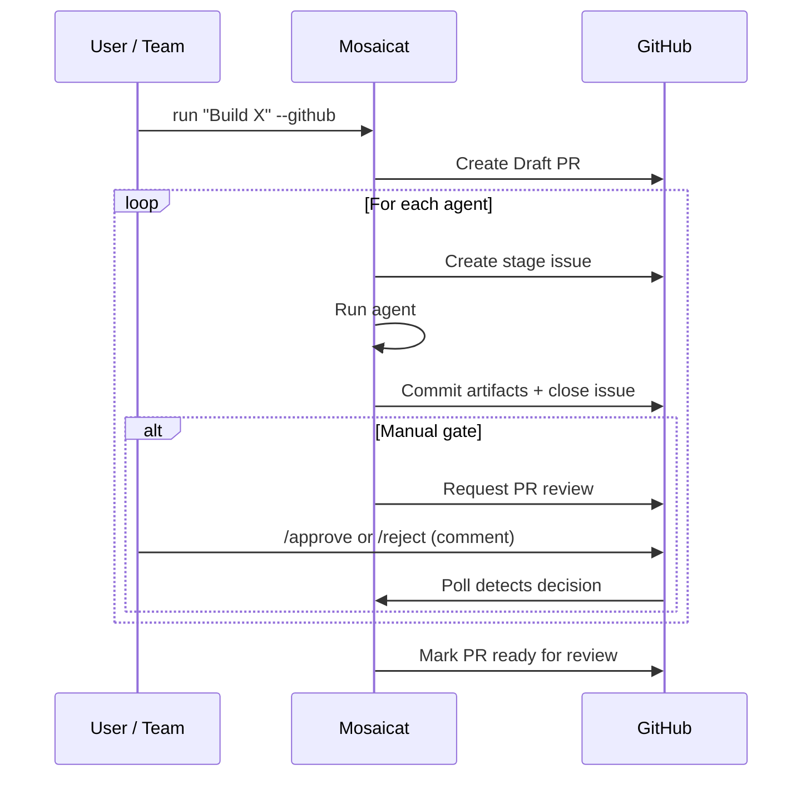
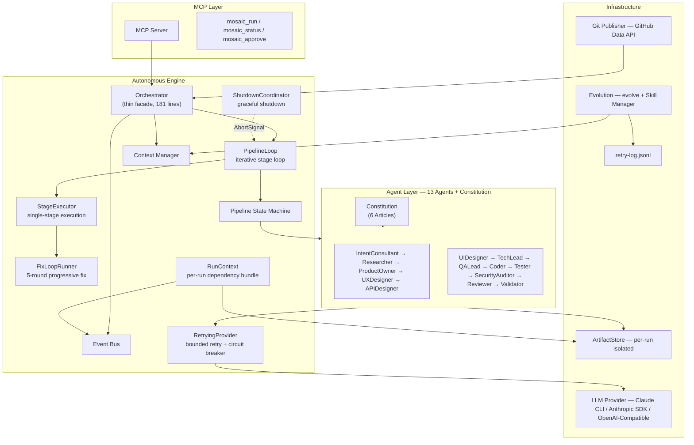

<p align="center">
  
</p>

<p align="center">
  <strong>Spec Coding — a spec-driven AI pipeline that turns a single instruction into<br/>layered specifications and acceptance-tested code.</strong>
</p>

<p align="center">
  <a href="README.md">简体中文</a> ·
  <a href="#demo">Demo</a> ·
  <a href="#quick-start">Quick Start</a> ·
  <a href="#how-it-works">How It Works</a> ·
  <a href="#comparison">Comparison</a>
</p>

<p align="center">
  <a href="LICENSE"></a>
  <a href="https://www.typescriptlang.org/"></a>
  <a href="https://nodejs.org/">= 18" /></a>
  <a href="https://modelcontextprotocol.io/"></a>
</p>

---

## Demo

```
$ npx tsx src/index.ts run "Build a personal finance tracker"

  Mosaicat v2 — Spec Coding Pipeline

  [1/13] IntentConsultant    ✓  intent-brief.json        12s
  [2/13] Researcher          ✓  research.md              45s
  [3/13] ProductOwner        ⏸  prd.md                   awaiting approval
         → approved
  [3/13] ProductOwner        ✓  prd.md                   38s
  [4/13] UXDesigner          ✓  ux-flows.md              52s
  [5/13] APIDesigner         ✓  api-spec.yaml            31s
  [6/13] UIDesigner          ⏸  components/              awaiting approval
         → approved
  [6/13] UIDesigner          ✓  components/ screenshots/ 4m 18s
  [7/13] TechLead            ⏸  tech-spec.md             awaiting approval
         → approved
  [7/13] TechLead            ✓  tech-spec.md             1m 05s
  [8/13] QALead              ✓  test-plan.md             48s
  [9/13] Coder               ✓  code/                    6m 22s
  [10/13] Tester             ✓  test-report.md           2m 10s
  [11/13] SecurityAuditor    ✓  security-report.md       35s
  [12/13] Reviewer           ⏸  review-report.md         awaiting approval
          → approved
  [12/13] Reviewer           ✓  review-report.md         42s
  [13/13] Validator          ✓  validation-report.md     8s

  ✓ Pipeline complete — 13 stages, 4 approvals, 18m 42s
  → .mosaic/artifacts/run-1774366900/
```

## Why Mosaicat?

Mosaicat implements **Spec Coding** — a delivery model where one instruction is processed by 13 AI agents in sequence, generating layered specifications (PRD -> UX flows -> API spec -> tech spec), each constraining the next agent. Code is the final derivative. Validation checks cross-spec conformance, not code quality.

- **Humans approve specs** at four critical checkpoints (PRD, design, architecture, code review). Everything between runs autonomously.
- **Spec boundaries isolate errors** — each agent sees only its upstream spec, never the reasoning behind it. Errors stay local instead of propagating through shared context.
- **Acceptance-driven completion** — QALead derives tests from PRD features first, Coder targets passing them, Tester verifies.
- **6 immutable constitution articles** — all agents share the same quality floor, auto-injected via BaseAgent hooks.
- **Resilience first** — bounded LLM retry (max 20 attempts) + circuit breaker (opens after 5 consecutive failures, 30s recovery) + Stage Resume crash recovery.

### Key Features

- **Spec-driven pipeline** — intent -> layered specifications (PRD -> UX -> API -> tech spec) -> code; each spec layer is the sole input contract for the next agent
- **13 autonomous agents** — mirrors a real product team: IntentConsultant, Researcher, ProductOwner, UX/UI Designer, APIDesigner, TechLead, QALead, Coder, Tester, SecurityAuditor, Reviewer, Validator
- **Acceptance TDD** — QALead derives acceptance tests from PRD -> Coder targets passing them -> Tester executes; 5-round progressive fix loop (rounds 1-2 direct-fix -> round 3 replan-failed-modules -> rounds 4-5 full-history-fix)
- **Agent Constitution** — 6 immutable quality articles (Verifiability First / Spec Is Authority / No Placeholder / Acceptance-Driven / Traceability / No Ambiguity), auto-injected via BaseAgent hooks
- **Crash recovery** — `resume` continues from the breakpoint; `--from <stage>` re-runs from a specific stage (automatically cleans up that stage's and downstream artifacts)
- **Bounded LLM retry + circuit breaker** — exponential backoff for transient errors (429, 503, network), max 20 attempts; 5 consecutive failures trip the circuit breaker (30s HALF_OPEN recovery)
- **Graceful shutdown** — SIGINT/SIGTERM triggers ShutdownCoordinator, completes current stage write before exiting, no partial artifacts left behind
- **Skeleton-implement code generation** — skeleton phase writes all files with real imports/routes, implement phase fills in logic per module; compile-verified at every step
- **Integrated QA pipeline** — QALead generates acceptance tests, Tester executes, SecurityAuditor runs programmatic + LLM security audit; test failures auto-trigger Coder fixes
- **Build validation + smoke test** — static analysis on build artifacts (bundle size, placeholder detection) + HTTP smoke test
- **Post-delivery refinement** — `refine` diagnoses and fixes issues in generated code with iterative feedback loop
- **Data-driven evolution** — `evolve` analyzes retry-log failure patterns, LLM generates skill proposals, human approves interactively
- **Multi-LLM support** — Claude, OpenAI, Gemini, DeepSeek, Qwen, Doubao, Kimi, MiniMax; run `setup` to switch providers
- **Batch UI generation** — components grouped by category for 80%+ fewer LLM calls; API spec auto-trimmed per batch
- **Configurable approval gates** — full autonomy, full manual, or anything in between per stage
- **8 layered validation checks** — 4 programmatic (zero LLM, fully deterministic) + 4 LLM-assisted (scoped to lightweight manifests)
- **Feature ID traceability** — `F-001` traced from PRD -> UX -> API -> Tests -> Code; task-level (`T-NNN`) from tech spec -> code
- **Visual design output** — React + Tailwind components with Playwright screenshots + HTML gallery
- **GitHub-native workflow** — Draft PR, stage issues, PR review approval gates — fits existing team processes
- **3 pipeline profiles** — `design-only` / `full` / `frontend-only`, auto-recommended by intent analysis
- **MCP compatible** — integrates with Claude Code as an external tool server

---

## Comparison

| Capability | Mosaicat | MetaGPT | CrewAI | v0 / bolt.new | Cursor / Windsurf |
|---|:---:|:---:|:---:|:---:|:---:|
| Spec-driven pipeline | ✅ Layered specs -> code | ❌ | ❌ | ❌ | ❌ |
| Full pipeline (idea -> code) | ✅ 13 agents | ✅ | ✅ | ❌ UI only | ❌ Code only |
| Acceptance TDD | ✅ QALead -> Coder -> Tester | ❌ | ❌ | ❌ | ❌ |
| Quality constitution | ✅ 6 articles auto-injected | ❌ | ❌ | ❌ | ❌ |
| Crash recovery | ✅ Stage Resume | ❌ | ❌ | ❌ | ❌ |
| Spec conformance validation | ✅ 8 checks | ❌ | ❌ | ❌ | ❌ |
| Feature ID traceability | ✅ F-NNN end-to-end | ❌ | ❌ | ❌ | ❌ |
| Configurable approval gates | ✅ Per-stage | ❌ | ❌ | ❌ | ❌ |
| GitHub-native workflow | ✅ PR + Issues | ❌ | ❌ | ❌ | ❌ |
| Visual design output | ✅ React + Playwright | ❌ | ❌ | ✅ | ❌ |
| Data-driven evolution | ✅ retry-log -> Skills | ❌ | ❌ | ❌ | ❌ |
| Integrated QA (test + security) | ✅ Auto test + audit | ❌ | ❌ | ❌ | ❌ |
| Post-delivery refinement | ✅ `refine` command | ❌ | ❌ | ❌ | ❌ |
| Bounded LLM retry + circuit breaker | ✅ Max 20 + breaker | ❌ | ❌ | N/A | N/A |
| Spec isolation | ✅ Strict contracts | ❌ Shared memory | ❌ Shared memory | N/A | N/A |
| Auth requirement | Claude subscription | API key | API key | Subscription | Subscription |

---

## Quick Start

### Prerequisites

| Requirement | Details |
|---|---|
| **Node.js** | v18 or later |
| **LLM Provider** | Default: Claude CLI (requires [Claude subscription](https://claude.ai/)). Or run `npx tsx src/index.ts setup` to configure: Anthropic API, OpenAI, Gemini, DeepSeek, Qwen, Doubao, Kimi, MiniMax. |
| **Playwright** (optional) | Required only for UI screenshot generation. Install with `npx playwright install chromium`. |
| **GitHub App** (optional) | Required only for `--github` mode. Install the [Mosaicat GitHub App](https://github.com/apps/mosaicatie) on your target repository, then login via `npx tsx src/index.ts login`. |

> **Claude CLI users**: Claude Pro / Team / Enterprise plans work out of the box. The pipeline uses `claude -p` with tool use, no separate API key needed. For other providers, run `npx tsx src/index.ts setup` and enter your API key.

### Install & Run

```bash
git clone https://github.com/ZB-ur/mosaicat.git
cd mosaicat
npm install
```

#### 0. Configure LLM (first time)

```bash
npx tsx src/index.ts setup
```

Interactive wizard: select provider -> enter API key -> test connection -> done. Run again anytime to switch providers.

> Skip this step if using Claude CLI (default) — no configuration needed.

#### 1. Basic Run

```bash
npx tsx src/index.ts run "Build a task management app"
```

The IntentConsultant asks clarifying questions, then the pipeline runs. Manual approval gates pause at ProductOwner, UIDesigner, TechLead, and Reviewer stages.

#### 2. Auto-Approve (CI / rapid prototyping)

```bash
npx tsx src/index.ts run "Build a task management app" --auto-approve
```

#### 3. Crash Recovery

```bash
npx tsx src/index.ts resume                     # resume the most recent interrupted run
npx tsx src/index.ts resume --run run-17743669   # resume a specific run
```

If a pipeline crashes mid-run (network drop, token limit, Ctrl+C), `resume` picks up from the last completed stage. Outputs from completed stages are preserved.

#### 4. GitHub Mode (team collaboration)

**Step 1 — Install the GitHub App**

1. Visit [github.com/apps/mosaicatie](https://github.com/apps/mosaicatie) and click **Install**
2. Choose the account/organization to install on
3. Select **Only select repositories** and pick your target repo (recommended), or **All repositories**
4. Click **Install** — the App requests these permissions:
   - **Contents** (read & write) — commit artifacts to your repo
   - **Issues** (read & write) — create stage tracking issues
   - **Pull requests** (read & write) — create Draft PRs and manage review gates
   - **Metadata** (read-only) — required by GitHub

**Step 2 — Login & Run**

```bash
npx tsx src/index.ts login                                       # one-time OAuth (device flow)
npx tsx src/index.ts run "Build a task management app" --github  # run in your repo directory
```

The `login` command displays a one-time code — paste it at the GitHub verification page to authorize. Credentials are saved locally at `~/.mosaicat/auth.json`.

Creates a Draft PR with stage issues. Team members approve via `/approve` comments on the PR.

#### 5. MCP Mode (IDE integration)

```bash
npx tsx src/mcp-entry.ts                                      # start MCP server
```

Add to your Claude Code MCP config, then use `mosaic_run` tool inside the IDE.

#### 6. Refine Generated Code

```bash
npx tsx src/index.ts refine "the login button does nothing"
npx tsx src/index.ts refine "homepage is blank" --run run-1774194269016  # target a specific run
```

After a pipeline run, use `refine` to iteratively fix issues. The RefineAgent diagnoses the root cause, applies fixes, and verifies with `tsc` + build.

#### 7. Data-Driven Evolution

```bash
npx tsx src/index.ts evolve
```

Analyzes retry-log failure patterns, LLM generates skill proposals, interactive approve/edit/reject. Skills are saved to `config/skills/builtin/` and automatically loaded in future runs.

### Usage Modes

| | CLI | GitHub | MCP |
|---|---|---|---|
| **Interface** | Terminal (inquirer) | PR + Issues | Claude Code |
| **Approval** | Interactive prompts | PR review comments | Tool responses |
| **Artifacts** | `.mosaic/artifacts/` | PR commits + local | `.mosaic/artifacts/` |
| **Best for** | Solo / rapid prototyping | Team collaboration | IDE integration |

<details>
<summary><strong>GitHub Mode — Detailed Flow</strong></summary>



GitHub mode fits naturally into existing team workflows — designers review component screenshots on the PR, product owners approve PRDs through review comments, tech leads sign off on architecture.

</details>

---

## How It Works

```mermaid
graph LR
    IC[Intent<br/>Consultant] --> R[Researcher]
    R --> PO[Product<br/>Owner]
    PO -->|"🔒"| UX[UX<br/>Designer]
    UX --> API[API<br/>Designer]
    API --> UI[UI<br/>Designer]
    UI -->|"🔒"| TL[Tech<br/>Lead]
    TL -->|"🔒"| QA[QA<br/>Lead]
    QA --> C[Coder]
    C --> T[Tester]
    T -->|"fix loop ×5<br/>(direct→replan→full-history)"| C
    T -->|"🔒"| SA[Security<br/>Auditor]
    SA --> RV[Reviewer]
    RV -->|"🔒"| V[Validator]

    style PO fill:#e8b4cb,stroke:#333,color:#000
    style UI fill:#e8b4cb,stroke:#333,color:#000
    style TL fill:#e8b4cb,stroke:#333,color:#000
    style T fill:#e8b4cb,stroke:#333,color:#000
    style RV fill:#e8b4cb,stroke:#333,color:#000
```



> 🔒 = configurable approval gate (manual by default). Set `--auto-approve` to skip, or configure per-stage in `config/pipeline.yaml`.

| # | Agent | Input | Output | Default Gate |
|---|---|---|---|---|
| 1 | **IntentConsultant** | User instruction | `intent-brief.json` | auto |
| 2 | **Researcher** | intent brief | `research.md` + manifest | auto |
| 3 | **ProductOwner** | intent brief + research | `prd.md` + manifest | **manual** |
| 4 | **UXDesigner** | PRD | `ux-flows.md` + manifest | auto |
| 5 | **APIDesigner** | PRD + UX flows | `api-spec.yaml` + manifest | auto |
| 6 | **UIDesigner** | PRD + UX + API spec | `components/` `screenshots/` `gallery.html` + manifest | **manual** |
| 7 | **TechLead** | PRD + UX + API spec | `tech-spec.md` + manifest | **manual** |
| 8 | **QALead** | tech spec + code manifest | `test-plan.md` + acceptance tests + manifest | auto |
| 9 | **Coder** | tech spec + API spec + acceptance tests | `code/` + manifest (skeleton -> implement -> build -> smoke test) | auto |
| 10 | **Tester** | test plan + code | `test-report.md` + manifest (failures -> Coder fix loop x5) | **manual** |
| 11 | **SecurityAuditor** | code + code manifest | `security-report.md` + manifest | auto |
| 12 | **Reviewer** | tech spec + code | `review-report.md` + manifest | **manual** |
| 13 | **Validator** | all manifests | `validation-report.md` (8 checks) | auto |

### Constitution and Acceptance TDD

Every agent automatically inherits **6 immutable constitution articles** (injected via BaseAgent hooks), ensuring a unified quality floor. The two most critical:

- **Acceptance-Driven Completion** — code completion standard = acceptance tests pass. QALead derives executable tests from PRD features -> Coder targets passing them -> Tester verifies. 5-round progressive fix loop.
- **No Placeholder Delivery** — user-visible paths must not contain Placeholder / Coming Soon content.

### Manifests and Spec Conformance

Each agent emits a **manifest** (~1-2 KB) declaring structural facts: which Feature IDs it covered, which files it produced. The Validator runs **8 layered checks** — 4 programmatic (set intersection, file existence — zero LLM) + 4 LLM-assisted (scoped to manifests, not full artifacts).

---

## Pipeline Profiles

| Profile | Stages | Use Case |
|---|---|---|
| `design-only` | Intent -> Research -> PRD -> UX -> API -> UI -> Validate | Product specification, design review |
| `full` | All 13 agents (incl. acceptance TDD) | End-to-end: idea -> acceptance-tested code |
| `frontend-only` | Skips APIDesigner | Frontend-focused projects |

```bash
npx tsx src/index.ts run "Build a blog" --profile design-only
```

The IntentConsultant auto-recommends a profile based on your instruction. Override with `--profile`.

---

## Architecture



### v2 Engine Modules

| Module | Responsibility |
|---|---|
| **Orchestrator** | Thin facade (181 lines), creates RunContext then delegates to PipelineLoop |
| **PipelineLoop** | While-loop iterating stages, checks AbortSignal, interprets StageOutcome to decide next step |
| **StageExecutor** | Executes a single stage, returns StageOutcome discriminated union, never recurses |
| **FixLoopRunner** | Tester-Coder fix loop: rounds 1-2 direct-fix -> round 3 replan-failed-modules -> rounds 4-5 full-history-fix |
| **ShutdownCoordinator** | Handles SIGINT/SIGTERM, notifies PipelineLoop via AbortController to exit gracefully after current stage completes, double-signal force exits |
| **RunContext** | Immutable dependency bundle: ArtifactStore / Logger / Provider / EventBus / Config / AbortSignal |
| **ArtifactStore** | Per-run instance replacing legacy global mutable state, isolates artifact directory per run |
| **RetryingProvider** | Decorates all LLM providers with bounded exponential-backoff retry (max 20) + circuit breaker (opens after 5 consecutive failures, 30s HALF_OPEN recovery) |

---

## Design Principles

### Spec Coding: Specifications as First-Class Artifacts

> The pipeline does not start by generating code. It generates a chain of increasingly detailed specifications — PRD -> UX flows -> API spec -> tech spec — and derives code as the final step. Each specification is the sole input contract for the next agent.

When AI handles execution, the valuable artifacts are specifications, not implementations. Every other design principle follows from this:

- **Spec isolation** exists because spec boundaries must be strict — agents reading a spec should not be influenced by how it was produced.
- **Manifest-based validation** works because specs have programmatically checkable structural properties (Feature coverage, endpoint mapping, file existence) without requiring LLM judgment.
- **Approval gates** sit between spec levels — humans approve one spec layer before the next is derived from it.

### Constitution: An Immutable Quality Floor

> 13 agents need a unified quality standard, but "unified" does not mean "copy-paste the same rules into 13 prompts."

The Mosaicat Static Constitution defines 6 immutable articles, auto-injected into every agent's system prompt via BaseAgent hooks. Violations are blocked by post-run checks.

Core articles: acceptance tests must pass for completion (not just compilation); user-visible paths must not contain placeholder content; F-NNN traceability must not break end-to-end.

### Acceptance TDD: Define "Done" Before Writing Code

> Testing after coding means expensive fix cycles. TDD gives Coder an explicit definition of "done."

QALead derives executable acceptance tests from PRD features -> Coder targets passing them -> Tester verifies. Failures trigger up to 5 progressive fix rounds (rounds 1-2 direct-fix -> round 3 replan-failed-modules -> rounds 4-5 full-history-fix). Each round accumulates context; strategy escalates with each attempt.

### Contracts, Not Conversations

> Multi-agent failures rarely come from dumb agents. They come from agents sharing too much context — errors correlate and propagate. The fix is not smarter agents. It is stricter spec boundaries.

Each agent sees only its contracted spec inputs, never upstream reasoning. The UXDesigner reads the PRD but does not know why the Researcher excluded a competitor. Errors stay local; each agent brings fresh judgment.

### Resilience First: Long Runs Should Not Be Fragile

> A full pipeline may run 30+ minutes and consume significant tokens. Losing everything to a single 429 or network blip is unacceptable.

- **RetryingProvider** decorates all LLM providers with bounded exponential-backoff retry (max 20 attempts) + circuit breaker protection (opens after 5 consecutive failures, 30s HALF_OPEN recovery)
- **ShutdownCoordinator** handles SIGINT/SIGTERM, notifies PipelineLoop via AbortSignal to exit gracefully after current stage completes
- **Stage Resume** persists state after every stage; `resume` picks up from the breakpoint after a crash; `--from <stage>` supports targeted re-run with automatic downstream artifact cleanup
- **retry-log** persists all retry events, providing real data for `evolve`

### Data-Driven Evolution

> Stage-level evolution calling LLM after every stage was mostly filtered by cooldown. Cost exceeded benefit.

Switched to manual `evolve`: based on retry-log real failure data (not manifest guesswork), aggregates high-frequency patterns, LLM generates skill proposals, human approves each one interactively. Data-driven > speculation-driven.

### From Execution Speed to Decision Speed

Traditional delivery methodologies (Scrum, Kanban) optimize human execution speed. When AI handles execution, the bottleneck shifts to human decision speed. Mosaicat places human decisions at spec transitions:

- **PRD approval** — is the problem spec correct?
- **Design review** — does the UX/UI spec match intent?
- **Tech spec sign-off** — is the architecture spec sound?
- **Code review** — does the implementation conform to its spec?

Everything between these spec approvals runs autonomously. This mirrors how senior engineering organizations already work — the pipeline just removes the manual execution between spec sign-offs.

<details>
<summary>Skill directory structure</summary>

```
config/skills/builtin/           # Built-in skills (version-controlled with codebase)
├── form-validation-zod/
│   └── SKILL.md
└── vitest-setup/
    └── SKILL.md

.mosaic/evolution/skills/        # Skills evolved from runtime data
├── shared/                      # Cross-agent skills
│   └── api-naming/
│       └── SKILL.md
└── ux-designer/                 # Agent-specific skills
    └── mobile-first/
        └── SKILL.md
```

Skills use progressive disclosure via trigger keywords: matching skills are fully loaded into prompts, non-matching skills show summaries only. Lifecycle managed via usage counts + deprecation markers.

</details>

---

## Outputs

Each run produces artifacts in an isolated directory:

```
.mosaic/artifacts/{run-id}/
├── intent-brief.json              # Structured intent from multi-turn dialogue
├── research.md                    # Market research + feasibility
├── prd.md                         # PRD with Feature IDs (F-001, F-002, ...)
├── ux-flows.md                    # Interaction flows + component inventory
├── api-spec.yaml                  # OpenAPI 3.0 specification
├── components/                    # 25+ React + Tailwind TSX components
├── previews/                      # Standalone HTML previews
├── screenshots/                   # Playwright-rendered PNGs
├── gallery.html                   # Visual gallery with embedded screenshots
├── tech-spec.md                   # Technical architecture + task breakdown
├── test-plan.md                   # QALead acceptance test plan
├── tests/acceptance/              # Executable acceptance tests (vitest)
├── code/                          # Generated source code (skeleton → implement → build)
├── code-plan.json                 # Module build plan with smoke test config
├── test-report.md                 # Tester execution results
├── security-report.md             # SecurityAuditor findings (programmatic + LLM)
├── review-report.md               # Code vs spec compliance review
├── validation-report.md           # 8-check cross-artifact validation
├── pipeline-state.json            # Pipeline state snapshot (for resume)
└── *.manifest.json                # Structural declarations per agent
```

---

## Roadmap

| Milestone | Status | Highlights |
|---|---|---|
| **M1** — MVP Pipeline | ✅ Done | 6 agents, state machine, CLI provider |
| **M2** — Observability + Delivery | ✅ Done | GitHub mode, screenshots, logging |
| **M3** — Idea to Code | ✅ Done | 10 agents, 3 profiles, Feature ID, self-evolution |
| **M6** — Optimization + Quality + QA | ✅ Done | Batch UI (86% fewer calls), 7 LLM providers, skeleton-implement Coder, QA team (13 agents), build smoke test, `refine` command |
| **M7** — Resilience + Constitution + Acceptance TDD | ✅ Done | 6 constitution articles, acceptance TDD, 5-round progressive fix, Stage Resume, bounded LLM retry + circuit breaker, `evolve` command |
| **v2 Core Engine Rewrite** | ✅ Done | Orchestrator thin facade, PipelineLoop, StageExecutor, FixLoopRunner, ShutdownCoordinator, ArtifactStore per-run instances, RunContext dependency bundle |
| **M8** — Scale + Enterprise | Planned | DAG execution engine, per-agent LLM routing, brownfield project support |

---

## Contributing

Contributions welcome. Please open an issue first to discuss what you'd like to change.

---

## License

[MIT](LICENSE)
