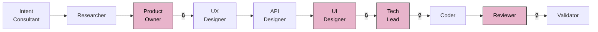
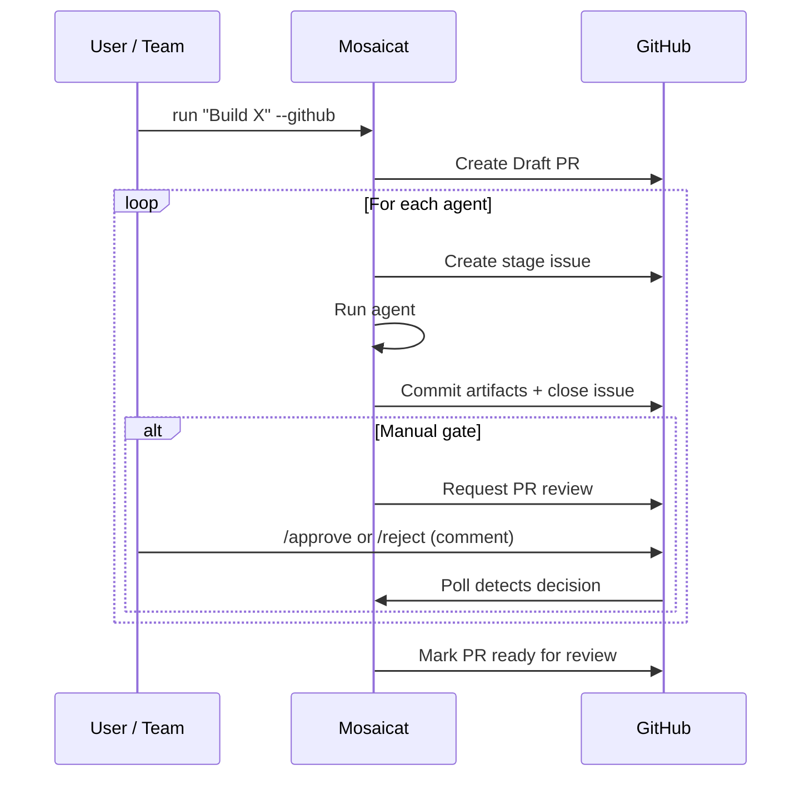
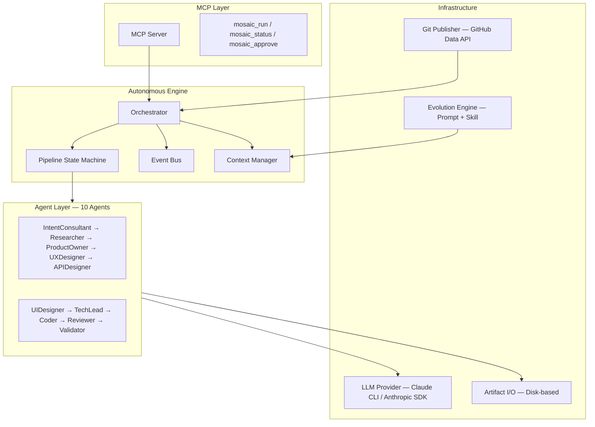

<p align="center">
  <!-- TODO: Replace with custom banner image (1200x400) -->
  
</p>

<p align="center">
  <strong>An AI-agent pipeline that turns a single instruction into validated product deliverables — <br/>research, PRD, UX flows, API spec, React components, code, and code review.</strong>
</p>

<p align="center">
  <a href="README.zh-CN.md">简体中文</a> ·
  <a href="#prerequisites">Prerequisites</a> ·
  <a href="#quick-start">Quick Start</a> ·
  <a href="#how-it-works">How It Works</a> ·
  <a href="#comparison">Comparison</a>
</p>

<p align="center">
  <a href="LICENSE"></a>
  <a href="https://www.typescriptlang.org/"></a>
  <a href="https://nodejs.org/">= 18" /></a>
  <a href="https://modelcontextprotocol.io/"></a>
</p>

---

## Why Mosaicat?

Traditional software delivery methodologies — Scrum, Kanban, SAFe — were designed to optimize **human execution efficiency**. In the AI era, execution shifts from humans to agents, and the bottleneck moves to **human decision efficiency**: are we building the right thing? Does the design make sense?

Mosaicat restructures the delivery pipeline around this insight:

- **Humans decide** at two critical points (PRD approval + design review). Everything else is autonomous.
- **Agents coordinate through contracts**, not conversations. Each agent sees only its contracted inputs — never upstream reasoning. Errors stay local instead of propagating through shared context.
- **Validation is programmatic**, not AI-judged. 8 deterministic checks on structural manifests (~500 bytes each), not 50k-token full-artifact reviews prone to hallucination.
- **Knowledge accumulates** across runs. Prompt evolution and skill capture turn each delivery into organizational memory — with human approval as the safety gate.

```
You:  "Build a personal finance tracker with income/expense logging and monthly reports"
       ↓
       10 AI agents run autonomously, humans approve at 2 checkpoints
       ↓
Out:  Research → PRD → UX Flows → OpenAPI Spec → 25 React Components + Screenshots
      → Tech Spec → Code → Code Review → 8-Check Validation Report
```

<!-- TODO: Add demo GIF or screenshot of pipeline terminal output here -->

### Key Features

- **10 autonomous agents** — mirrors a real product team: PM, designer, architect, coder, reviewer
- **Configurable approval gates** — full autonomy, full manual, or anything in between per stage
- **8 deterministic validation checks** — cross-artifact consistency verified without LLM
- **Feature ID traceability** — `F-001` traced end-to-end from PRD → UX → API → Code → Review
- **Visual design output** — React + Tailwind components with Playwright screenshots + HTML gallery
- **GitHub-native workflow** — Draft PR, stage issues, PR review approval gates — fits existing team processes
- **Self-evolution with human oversight** — prompt + skill accumulation, all proposals require approval
- **3 pipeline profiles** — `design-only` / `full` / `frontend-only`, auto-recommended by intent analysis
- **MCP compatible** — runs inside Claude Code as a tool server

---

## Prerequisites

| Requirement | Details |
|---|---|
| **Node.js** | v18 or later |
| **Claude subscription** | [Claude Pro / Team / Enterprise](https://claude.ai/) — Mosaicat calls Claude CLI (`claude -p`) for LLM inference. No separate API key needed. |
| **Claude CLI** | Installed and authenticated. Run `claude` in your terminal to verify. See [Claude Code docs](https://docs.anthropic.com/en/docs/claude-code/overview) for setup. |
| **Playwright** (optional) | Required only for UI screenshot generation. Install with `npx playwright install chromium`. |
| **GitHub account** (optional) | Required only for `--github` mode. Login via `npx tsx src/index.ts login`. |

> **Enterprise / Team users**: Claude Team and Enterprise plans work out of the box. The pipeline uses `claude -p` with tool use, which is included in all Claude subscriptions. No API key management, no token budgets to configure.

---

## Quick Start

```bash
git clone https://github.com/anthropics/mosaicat.git
cd mosaicat
npm install
```

### 1. Basic Run

```bash
npx tsx src/index.ts run "Build a task management app"
```

The IntentConsultant asks clarifying questions, then the pipeline runs. Manual approval gates pause at ProductOwner, UIDesigner, TechLead, and Reviewer stages.

### 2. Auto-Approve (CI / rapid prototyping)

```bash
npx tsx src/index.ts run "Build a task management app" --auto-approve
```

### 3. GitHub Mode (team collaboration)

```bash
npx tsx src/index.ts login                                    # one-time OAuth
npx tsx src/index.ts run "Build a task management app" --github
```

Creates a Draft PR with stage issues. Team members approve via `/approve` comments on the PR.

### 4. MCP Mode (IDE integration)

```bash
npx tsx src/mcp-entry.ts                                      # start MCP server
```

Add to your Claude Code MCP config, then use `mosaic_run` tool inside the IDE.

### 5. With Self-Evolution

```bash
npx tsx src/index.ts run "Build a task management app" --evolve
```

After each stage, the evolution engine analyzes performance and proposes prompt improvements or new skills. All proposals require human approval.

---

## How It Works



> 🔒 = configurable approval gate (manual by default). Set `--auto-approve` to skip, or configure per-stage in `config/pipeline.yaml`.

| # | Agent | Input | Output | Default Gate |
|---|---|---|---|---|
| 1 | **IntentConsultant** | User instruction | `intent-brief.json` | auto |
| 2 | **Researcher** | intent brief | `research.md` + manifest | auto |
| 3 | **ProductOwner** | intent brief + research | `prd.md` + manifest | **manual** |
| 4 | **UXDesigner** | PRD | `ux-flows.md` + manifest | auto |
| 5 | **APIDesigner** | PRD + UX flows | `api-spec.yaml` + manifest | auto |
| 6 | **UIDesigner** | PRD + UX + API spec | `components/` `screenshots/` `gallery.html` + manifest | **manual** |
| 7 | **TechLead** | PRD + UX + API spec | `tech-spec.md` + manifest | **manual** |
| 8 | **Coder** | tech spec + API spec | `code/` + manifest | auto |
| 9 | **Reviewer** | tech spec + code | `review-report.md` + manifest | **manual** |
| 10 | **Validator** | all manifests | `validation-report.md` (8 checks) | auto |

### Manifests and Validation

Each agent emits a **manifest** (~500 bytes) declaring structural facts: which Feature IDs it covered, which files it produced. The Validator runs **8 deterministic checks** — set intersection, file existence, schema conformance — without calling any LLM. This is how you validate AI output at scale without trusting another AI to do the checking.

---

## Pipeline Profiles

| Profile | Stages | Use Case |
|---|---|---|
| `design-only` | Intent → Research → PRD → UX → API → UI → Validate | Product specification, design review |
| `full` | All 10 agents | End-to-end: idea → validated code |
| `frontend-only` | Skips APIDesigner | Frontend-focused projects |

```bash
npx tsx src/index.ts run "Build a blog" --profile design-only
```

The IntentConsultant auto-recommends a profile based on your instruction. Override with `--profile`.

---

## Usage Modes

| | CLI | GitHub | MCP |
|---|---|---|---|
| **Interface** | Terminal (inquirer) | PR + Issues | Claude Code |
| **Approval** | Interactive prompts | PR review comments | Tool responses |
| **Artifacts** | `.mosaic/artifacts/` | PR commits + local | `.mosaic/artifacts/` |
| **Best for** | Solo / rapid prototyping | Team collaboration | IDE integration |

<details>
<summary><strong>GitHub Mode — Detailed Flow</strong></summary>



GitHub mode fits naturally into existing team workflows — designers review component screenshots on the PR, product owners approve PRDs through review comments, tech leads sign off on architecture. No new tools to learn.

<!-- TODO: Add real screenshots of GitHub PR workflow -->

</details>

---

## Comparison

| Capability | Mosaicat | MetaGPT | CrewAI | v0 / bolt.new | Cursor / Windsurf |
|---|:---:|:---:|:---:|:---:|:---:|
| Full pipeline (idea → code) | ✅ 10 agents | ✅ | ✅ | ❌ UI only | ❌ Code only |
| Deterministic validation | ✅ 8 checks | ❌ | ❌ | ❌ | ❌ |
| Feature ID traceability | ✅ F-NNN end-to-end | ❌ | ❌ | ❌ | ❌ |
| Configurable approval gates | ✅ Per-stage | ❌ | ❌ | ❌ | ❌ |
| GitHub-native workflow | ✅ PR + Issues | ❌ | ❌ | ❌ | ❌ |
| Visual design output | ✅ React + Playwright | ❌ | ❌ | ✅ | ❌ |
| Self-evolution | ✅ Human-approved | ❌ | ❌ | ❌ | ❌ |
| Artifact isolation | ✅ Strict contracts | ❌ Shared memory | ❌ Shared memory | N/A | N/A |
| Auth requirement | Claude subscription | API key | API key | Subscription | Subscription |

---

## Design Principles

### Contracts, Not Conversations

> Multi-agent failures rarely come from dumb agents. They come from agents sharing too much context — errors correlate and propagate. The fix isn't smarter agents. It's stricter boundaries.

**Artifact Isolation** — Each agent sees only its contracted inputs, never upstream reasoning. The UX Designer reads the PRD but doesn't know why the Researcher excluded a competitor. This is not a limitation; it is the architecture. Errors stay local. Each agent brings fresh judgment.

**Manifest-Based Validation** — Full-artifact validation costs 50k+ tokens and hallucinations pass as checks. Instead, each agent emits a ~500-byte manifest declaring structural facts. The Validator runs 8 deterministic checks — zero LLM. This scales to enterprise pipelines where you cannot afford probabilistic quality gates.

### Autonomy With Guardrails

Agents are fully autonomous within their scope — they can use tools, spawn sub-agents, search the web. But autonomy is bounded by configurable constraints:

| Constraint | Configuration | Example |
|---|---|---|
| **Allowed tools** | `config/agents.yaml` | Coder: `[Read, Write, Bash, Agent, WebSearch]` |
| **Writable paths** | `config/agents.yaml` | Coder: `.mosaic/artifacts/code/` only |
| **Max turns** | `config/agents.yaml` | Researcher: 3, Coder: 10 |
| **Approval gates** | `config/pipeline.yaml` | ProductOwner: manual, Researcher: auto |

Full autonomy with production-grade guardrails. No all-or-nothing choice.

### From Execution Speed to Decision Speed

Traditional delivery methodologies (Scrum, Kanban) optimize human execution speed. When AI handles execution, the bottleneck shifts to human decision speed. Mosaicat's pipeline requires human decisions at exactly the right points:

- **PRD approval** — are we building the right thing?
- **Design review** — does the UX/UI match intent?
- **Tech spec sign-off** — is the architecture sound?
- **Code review** — does the implementation match spec?

Everything between these checkpoints runs autonomously. This mirrors how senior engineering organizations already work — the pipeline just removes the manual execution between decisions.

### Self-Evolution: Organizational Memory That Grows

Each pipeline run can improve the system. The evolution engine proposes:

- **Prompt evolution** — improved agent system prompts based on run outcomes (24h cooldown between versions)
- **Skill capture** — reusable domain knowledge saved as `SKILL.md` files, shared across agents or agent-specific

Critical safety constraints:
- All proposals require **human approval** before taking effect
- The evolution mechanism itself **cannot evolve** — a deliberate invariant
- Skills follow the open [Agent Skills standard](https://github.com/anthropics/agent-skills) format

Over time, the pipeline accumulates organizational knowledge: naming conventions, API patterns, design preferences, domain-specific heuristics. This knowledge persists across team members and survives personnel changes — it lives in the system, not in people's heads.

<details>
<summary>Skill directory structure</summary>

```
.mosaic/evolution/skills/
├── shared/              # Cross-agent skills (e.g., API naming conventions)
│   └── api-naming/
│       └── SKILL.md
└── ux-designer/         # Agent-specific skills (e.g., mobile-first patterns)
    └── mobile-first/
        └── SKILL.md
```

</details>

---

## Architecture



---

## Outputs

A single `--profile full` run produces:

```
.mosaic/artifacts/
├── intent-brief.json              # Structured intent from multi-turn dialogue
├── research.md                    # Market research + feasibility
├── prd.md                         # PRD with Feature IDs (F-001, F-002, ...)
├── ux-flows.md                    # Interaction flows + component inventory
├── api-spec.yaml                  # OpenAPI 3.0 specification
├── components/                    # 25+ React + Tailwind TSX components
├── previews/                      # Standalone HTML previews
├── screenshots/                   # Playwright-rendered PNGs
├── gallery.html                   # Visual gallery with embedded screenshots
├── tech-spec.md                   # Technical architecture + task breakdown
├── code/                          # Generated source code
├── review-report.md               # Code vs spec compliance review
├── validation-report.md           # 8-check cross-artifact validation
└── *.manifest.json                # Structural declarations per agent
```

<!-- TODO: Add sample screenshots from a real pipeline run -->

---

## Roadmap

| Milestone | Status | Highlights |
|---|---|---|
| **M1** — MVP Pipeline | ✅ Done | 6 agents, state machine, CLI provider |
| **M2** — Observability + Delivery | ✅ Done | GitHub mode, screenshots, logging |
| **M3** — Idea to Code | ✅ Done | 10 agents, 3 profiles, Feature ID, self-evolution |
| **M4** — Quality + Scale | Planned | QA team agents, DAG engine, brownfield project support |

---

## Contributing

Contributions welcome. Please open an issue first to discuss what you'd like to change.

<!-- TODO: Add contributor wall via contrib.rocks when repo is public -->

---

## License

[MIT](LICENSE)

<!--
## Star History

TODO: Add star history chart when repo gains traction
[](https://star-history.com/#ZB-ur/mosaicat&Date)
-->
