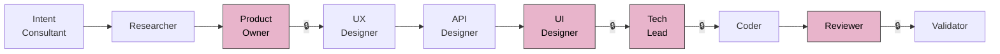
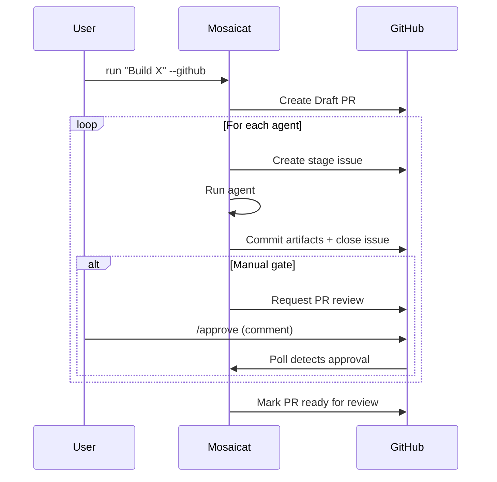
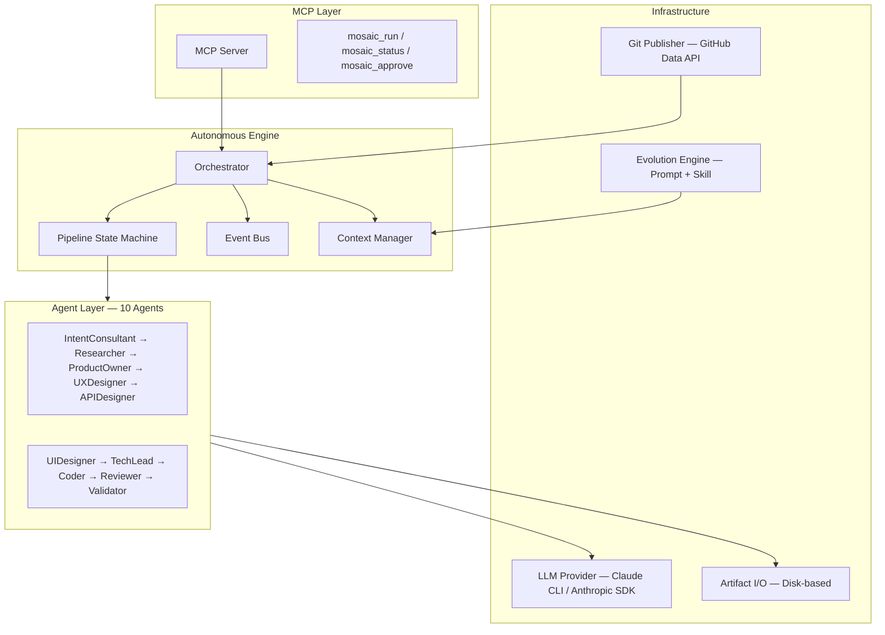

<p align="center">
  <!-- TODO: Replace with custom banner image (1200x400) -->
  
</p>

<p align="center">
  <strong>One instruction, ten AI agents deliver a full product specification — with 8 programmatic checks.</strong>
</p>

<p align="center">
  <a href="README.zh-CN.md">简体中文</a> ·
  <a href="#quick-start">Quick Start</a> ·
  <a href="#how-it-works">How It Works</a> ·
  <a href="#competitive-comparison">Comparison</a>
</p>

<p align="center">
  <a href="LICENSE"></a>
  <a href="https://www.typescriptlang.org/"></a>
  <a href="https://nodejs.org/">= 18" /></a>
  <a href="https://modelcontextprotocol.io/"></a>
</p>

---

## What Is Mosaicat?

```
You:  "Build a personal finance tracker with income/expense logging and monthly reports"
       ↓
       10 AI agents run autonomously
       ↓
Out:  Research → PRD → UX Flows → OpenAPI Spec → 25 React Components + Screenshots
      → Tech Spec → Code → Code Review → 8-Check Validation Report
```

No API keys. No configuration. Just a Claude subscription and one command.

<!-- TODO: Add demo GIF or screenshot of pipeline terminal output here -->

### Key Features

- **10 autonomous agents** — from intent clarification to code review, each with contracted inputs/outputs
- **8 programmatic validation checks** — deterministic cross-artifact verification, no LLM involved
- **Feature ID traceability** — `F-001` → `F-002` traced end-to-end across PRD → UX → API → Code
- **Visual design output** — React + Tailwind components with Playwright screenshots + gallery
- **3 pipeline profiles** — `design-only` / `full` / `frontend-only`, auto-recommended by intent
- **GitHub-native workflow** — Draft PR, stage issues, PR review approval gates
- **Self-evolution** — prompt + skill accumulation with human-approved proposals
- **MCP compatible** — works as a tool inside Claude Code

---

## How It Works



> 🔒 = manual approval gate. Human decides at PRD and Design. Everything else is autonomous.

| # | Agent | Input | Output | Gate |
|---|---|---|---|---|
| 1 | **IntentConsultant** | User instruction | `intent-brief.json` | auto |
| 2 | **Researcher** | intent brief | `research.md` + manifest | auto |
| 3 | **ProductOwner** | intent brief + research | `prd.md` + manifest | **manual** |
| 4 | **UXDesigner** | PRD | `ux-flows.md` + manifest | auto |
| 5 | **APIDesigner** | PRD + UX flows | `api-spec.yaml` + manifest | auto |
| 6 | **UIDesigner** | PRD + UX + API spec | `components/` `screenshots/` `gallery.html` + manifest | **manual** |
| 7 | **TechLead** | PRD + UX + API spec | `tech-spec.md` + manifest | **manual** |
| 8 | **Coder** | tech spec + API spec | `code/` + manifest | auto |
| 9 | **Reviewer** | tech spec + code | `review-report.md` + manifest | **manual** |
| 10 | **Validator** | all manifests | `validation-report.md` (8 checks) | auto |

Each agent emits a **manifest** (~500 bytes) — a structural declaration of what it covered (`F-001`, `F-002`...). The Validator cross-references all manifests with 8 deterministic checks. No LLM involved in validation.

---

## Quick Start

```bash
git clone https://github.com/anthropics/mosaicat.git
cd mosaicat && npm install
```

**Interactive** — the IntentConsultant asks questions, manual gates pause for approval:

```bash
npx tsx src/index.ts run "Build a task management app"
```

**Auto-approve** — skip all gates, full speed:

```bash
npx tsx src/index.ts run "Build a task management app" --auto-approve
```

**GitHub mode** — Draft PR + stage issues + PR review approval:

```bash
npx tsx src/index.ts login                                    # one-time OAuth
npx tsx src/index.ts run "Build a task management app" --github
```

**MCP mode** — use inside Claude Code:

```bash
npx tsx src/mcp-entry.ts                                      # start MCP server
```

---

## Pipeline Profiles

| Profile | Agents | Use Case |
|---|---|---|
| `design-only` | Intent → Research → PRD → UX → API → UI → Validate | Product spec + visual design |
| `full` | All 10 agents | Idea → code + review |
| `frontend-only` | Skips APIDesigner | Frontend-focused projects |

```bash
npx tsx src/index.ts run "Build a blog" --profile design-only
```

The IntentConsultant auto-recommends a profile based on your instruction. Override with `--profile`.

---

## Usage Modes

| | CLI | GitHub | MCP |
|---|---|---|---|
| **Interface** | Terminal (inquirer) | PR + Issues | Claude Code |
| **Approval** | Interactive prompts | PR review comments | Tool responses |
| **Artifacts** | `.mosaic/artifacts/` | PR commits + local | `.mosaic/artifacts/` |
| **Best for** | Quick iteration | Team collaboration | IDE integration |

<details>
<summary><strong>GitHub Mode — Detailed Flow</strong></summary>



<!-- TODO: Add real screenshots of GitHub PR workflow -->

</details>

---

## Competitive Comparison

| Capability | Mosaicat | MetaGPT | CrewAI | v0 / bolt.new | Cursor / Windsurf |
|---|:---:|:---:|:---:|:---:|:---:|
| Full pipeline (idea → code) | ✅ 10 agents | ✅ | ✅ | ❌ UI only | ❌ Code only |
| Structured validation | ✅ 8 deterministic checks | ❌ | ❌ | ❌ | ❌ |
| Feature ID traceability | ✅ F-NNN end-to-end | ❌ | ❌ | ❌ | ❌ |
| GitHub-native workflow | ✅ PR + Issues | ❌ | ❌ | ❌ | ❌ |
| Visual design output | ✅ React + Playwright | ❌ | ❌ | ✅ | ❌ |
| Self-evolution | ✅ Prompt + Skill | ❌ | ❌ | ❌ | ❌ |
| Auth requirement | Claude sub only | API key | API key | Sub | Sub |
| Artifact isolation | ✅ Strict contracts | ❌ Shared memory | ❌ Shared memory | N/A | N/A |

---

## The Contract Layer — Why Dumber Interfaces Build Smarter Systems

> Most multi-agent failures come not from dumb agents, but from agents sharing too much context — errors correlate and propagate. The fix isn't smarter agents. It's stricter boundaries.

**Artifact Isolation** — Each agent sees only its contracted inputs, never upstream reasoning. The UX Designer reads the PRD but doesn't know why the Researcher excluded a competitor. Errors stay local.

**Manifest Validation** — Full-artifact validation costs 50k+ tokens and hallucinations pass as checks. Instead, each agent emits a ~500-byte manifest declaring structural facts. The Validator runs 8 deterministic checks — set intersection, file existence, schema conformance — zero LLM.

**Decision Efficiency** — Traditional methodologies optimize human execution speed. Post-AI, execution is free. The bottleneck is human decision speed. This pipeline requires human decisions at exactly two points: Is the PRD right? Does the design look good? Everything else is autonomous.

**Evolution as Memory** — Prompt evolution + skill accumulation = organizational knowledge. But all evolution requires human approval, and the evolution mechanism itself cannot evolve — a deliberate constraint.

> Mosaicat is not a better way to use AI agents. It is a different theory of how AI agents should coordinate: through contracts, not conversations.

---

## Architecture



---

## Outputs Gallery

A single `--profile full` run produces:

```
.mosaic/artifacts/
├── intent-brief.json              # Structured intent from multi-turn dialogue
├── research.md                    # Market research + feasibility
├── prd.md                         # PRD with Feature IDs (F-001, F-002, ...)
├── ux-flows.md                    # Interaction flows + component inventory
├── api-spec.yaml                  # OpenAPI 3.0 specification
├── components/                    # 25+ React + Tailwind TSX components
├── previews/                      # Standalone HTML previews
├── screenshots/                   # Playwright-rendered PNGs
├── gallery.html                   # Visual gallery with embedded screenshots
├── tech-spec.md                   # Technical architecture + task breakdown
├── code/                          # Generated source code
├── review-report.md               # Code vs spec compliance review
├── validation-report.md           # 8-check cross-artifact validation
└── *.manifest.json                # Structural declarations per agent
```

<!-- TODO: Add sample screenshots from a real pipeline run -->

---

## Self-Evolution

After each stage, the evolution engine may propose:

- **Prompt evolution** — improved agent system prompts (24h cooldown)
- **Skill creation** — reusable domain knowledge as `SKILL.md` files (no cooldown)

All proposals require **human approval**. The evolution mechanism itself cannot evolve.

<details>
<summary>Skill directory structure</summary>

```
.mosaic/evolution/skills/
├── shared/              # Cross-agent skills
│   └── api-naming/
│       └── SKILL.md
└── ux-designer/         # Agent-specific skills
    └── mobile-first/
        └── SKILL.md
```

</details>

---

## Roadmap

| Milestone | Status | Highlights |
|---|---|---|
| **M1** — MVP Pipeline | ✅ Done | 6 agents, state machine, CLI provider |
| **M2** — Observability + Delivery | ✅ Done | GitHub mode, screenshots, logging |
| **M3** — Idea to Code | ✅ Done | 10 agents, 3 profiles, Feature ID, evolution |
| **M4** — Quality + Scale | Planned | QA agents, DAG engine, brownfield projects |

---

## Contributing

Contributions are welcome! Please open an issue first to discuss what you'd like to change.

<!-- TODO: Add contributor wall via contrib.rocks when repo is public -->

---

## License

[MIT](LICENSE)

<!--
## Star History

TODO: Add star history chart when repo gains traction
[](https://star-history.com/#ZB-ur/mosaicat&Date)
-->
