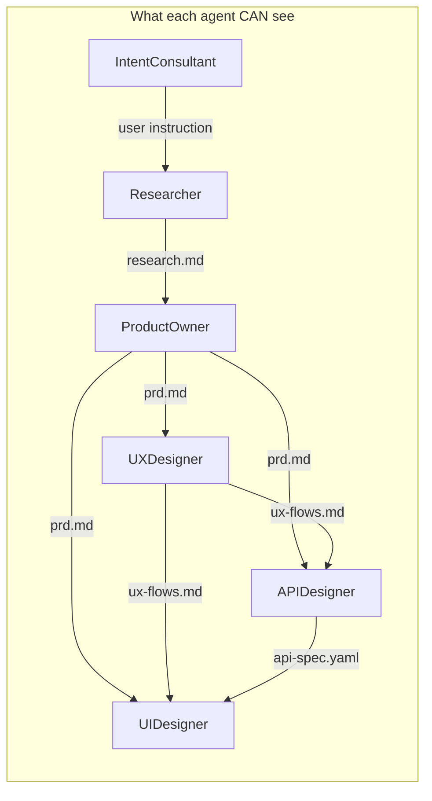
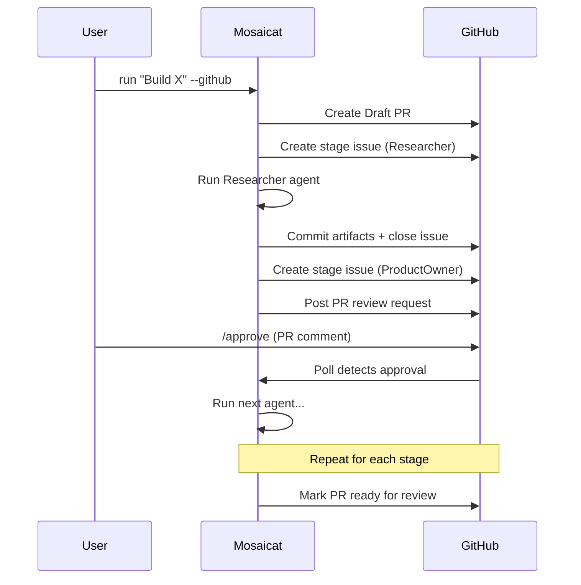
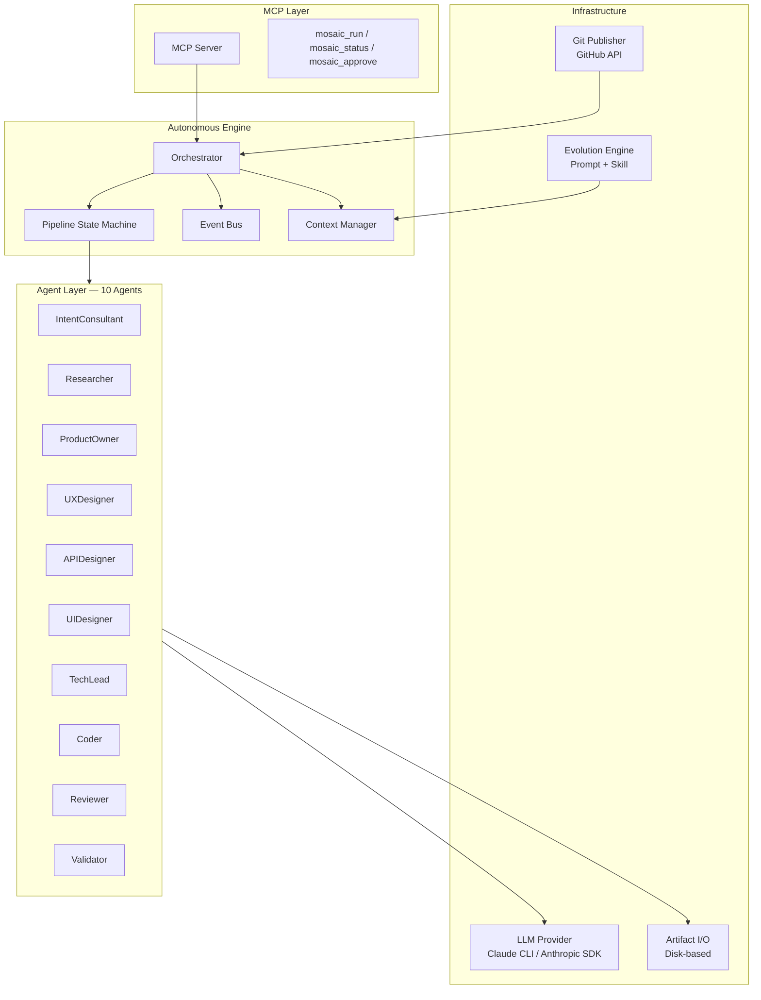

# Mosaicat

**One instruction. Ten AI agents. Full product specification — validated.**

[中文版](README.zh-CN.md)

<!-- [](LICENSE) -->
[](https://www.typescriptlang.org/)
[](https://nodejs.org/)
[](https://modelcontextprotocol.io/)

---

## The 10-Second Pitch

Mosaicat turns a single sentence into a full product specification: research, PRD, UX flows, OpenAPI spec, React components with screenshots, tech spec, code, and code review — validated by 8 programmatic checks.

No API keys. No configuration. Just a Claude subscription and one command.

---

## Philosophy: The Contract Layer

**Why Dumber Interfaces Build Smarter Systems**

Multi-agent systems fail not because agents are dumb, but because they share too much context. When Agent B sees Agent A's reasoning, errors correlate and propagate. The fix isn't smarter agents — it's stricter boundaries.

### Artifact Isolation = Information Hygiene

Every agent sees only its contracted inputs, never the upstream reasoning process. The UX Designer reads the PRD; it doesn't know why the Researcher excluded a competitor. This isn't a limitation — it's architecture. Errors stay local. Each agent brings fresh judgment to its contracted inputs.

### Manifest = Validating AI Without AI

Full-artifact validation would cost 50k+ tokens and hallucinations would pass as checks. Instead, each agent emits a manifest (~500 bytes) declaring structural facts: "I covered features F-001, F-002." The Validator runs 8 deterministic checks — set intersection, file existence, schema conformance — no LLM needed.

### From Execution Speed to Decision Speed

Traditional methodologies optimize human execution speed. Post-AI, execution is ~free. The bottleneck shifts to human decision speed. Mosaicat's pipeline requires human decisions at exactly two points: Is the PRD right? Does the design look good? Everything else is autonomous.

### Evolution = Organizational Memory

Prompt evolution + skill accumulation = organizational knowledge that outlives any single run. But all evolution requires human approval, and the evolution mechanism itself cannot evolve — a deliberate constraint against runaway self-modification.

> Mosaicat is not a better way to use AI agents. It is a different theory of how AI agents should coordinate: through contracts, not conversations.

---

## How It Works

```mermaid
graph LR
    IC[IntentConsultant] --> R[Researcher]
    R --> PO[ProductOwner]
    PO -->|🔒 manual gate| UX[UXDesigner]
    UX --> API[APIDesigner]
    API --> UI[UIDesigner]
    UI -->|🔒 manual gate| TL[TechLead]
    TL -->|🔒 manual gate| C[Coder]
    C --> RV[Reviewer]
    RV -->|🔒 manual gate| V[Validator]

    style PO fill:#f9f,stroke:#333
    style UI fill:#f9f,stroke:#333
    style TL fill:#f9f,stroke:#333
    style RV fill:#f9f,stroke:#333
```



<sub>Pink nodes = manual approval gates. Remaining transitions are automatic.</sub>

| Agent | Input | Output | Gate |
|---|---|---|---|
| **IntentConsultant** | User instruction | `intent-brief.json` | auto |
| **Researcher** | `intent-brief.json` | `research.md` + manifest | auto |
| **ProductOwner** | `intent-brief.json` + `research.md` | `prd.md` + manifest | **manual** |
| **UXDesigner** | `prd.md` | `ux-flows.md` + manifest | auto |
| **APIDesigner** | `prd.md` + `ux-flows.md` | `api-spec.yaml` + manifest | auto |
| **UIDesigner** | `prd.md` + `ux-flows.md` + `api-spec.yaml` | `components/` + `screenshots/` + `gallery.html` + manifest | **manual** |
| **TechLead** | `prd.md` + `ux-flows.md` + `api-spec.yaml` | `tech-spec.md` + manifest | **manual** |
| **Coder** | `tech-spec.md` + `api-spec.yaml` | `code/` + manifest | auto |
| **Reviewer** | `tech-spec.md` + `code/` + `code.manifest.json` | `review-report.md` + manifest | **manual** |
| **Validator** | All `*.manifest.json` | `validation-report.md` | auto |

Each manifest is a ~500-byte structural declaration (feature IDs covered, files produced). The Validator cross-references them with 8 programmatic checks — no LLM involved.

### Artifact Isolation Boundaries



Agents communicate only through disk files. No shared memory. No pipeline history. Each agent sees exactly its contracted inputs — nothing more.

---

## Competitive Comparison

| Capability | Mosaicat | MetaGPT | CrewAI | v0 / bolt.new | Cursor / Windsurf |
|---|:---:|:---:|:---:|:---:|:---:|
| Full pipeline (idea → code) | ✅ 10 agents | ✅ | ✅ | ❌ UI only | ❌ Code only |
| Structured validation (8 checks) | ✅ Deterministic | ❌ | ❌ | ❌ | ❌ |
| Feature ID traceability (F-NNN) | ✅ End-to-end | ❌ | ❌ | ❌ | ❌ |
| GitHub-native workflow (PR + Review) | ✅ Draft PR + Issues | ❌ | ❌ | ❌ | ❌ |
| Visual design output | ✅ React + Playwright | ❌ | ❌ | ✅ | ❌ |
| Self-evolution | ✅ Prompt + Skill | ❌ | ❌ | ❌ | ❌ |
| Auth requirement | Claude sub only | API key | API key | Subscription | Subscription |
| Artifact isolation | ✅ Strict contracts | ❌ Shared memory | ❌ Shared memory | N/A | N/A |

---

## Quick Start

```bash
git clone https://github.com/anthropics/mosaicat.git
cd mosaicat
npm install
```

### CLI — Interactive Mode

```bash
npx tsx src/index.ts run "Build a task management app"
```

The IntentConsultant will ask clarifying questions, then the pipeline runs with manual approval gates at ProductOwner, UIDesigner, TechLead, and Reviewer stages.

### CLI — Auto-Approve

```bash
npx tsx src/index.ts run "Build a task management app" --auto-approve
```

Skips all manual gates. Useful for quick iteration or CI.

### GitHub Mode

```bash
npx tsx src/index.ts login          # One-time OAuth device flow
npx tsx src/index.ts run "Build a task management app" --github
```

Creates a Draft PR, opens stage issues for each agent, and uses PR review comments for approval gates.

### MCP Mode

Add to your Claude Code MCP config, then use `mosaic_run` tool inside Claude Code.

```bash
npx tsx src/mcp-entry.ts
```

---

## Usage Modes

| | CLI Mode | GitHub Mode | MCP Mode |
|---|---|---|---|
| **Interface** | Terminal (inquirer) | GitHub PR + Issues | Claude Code |
| **Approval** | Interactive prompts | PR review comments | Tool responses |
| **Artifacts** | `.mosaic/artifacts/` | PR commits + local | `.mosaic/artifacts/` |
| **Best for** | Quick iteration | Team collaboration | IDE integration |

### GitHub Mode Flow



<!-- TODO: Add real screenshots of GitHub PR workflow -->

---

## Pipeline Profiles

Choose how far the pipeline goes:

| Profile | Stages | Use Case |
|---|---|---|
| **design-only** | IntentConsultant → Researcher → ProductOwner → UXDesigner → APIDesigner → UIDesigner → Validator | Product specification + visual design |
| **full** | All 10 agents | End-to-end: idea → code + review |
| **frontend-only** | Skips APIDesigner | Frontend-focused projects |

```bash
# Explicit profile
npx tsx src/index.ts run "Build a blog" --profile design-only

# IntentConsultant recommends a profile based on your instruction
npx tsx src/index.ts run "Build a blog"
```

---

## Architecture



---

## Self-Evolution

After each pipeline stage completes, the evolution engine analyzes performance and may propose:

- **Prompt evolution**: Improved system prompts for agents (24h cooldown between versions)
- **Skill creation**: Reusable domain knowledge captured as `SKILL.md` files (no cooldown)

All proposals require **human approval**. The evolution mechanism itself cannot be evolved — a deliberate safety constraint.

Skills follow the [Agent Skills open standard](https://github.com/anthropics/agent-skills) format:
```
.mosaic/evolution/skills/
├── shared/           # Cross-agent skills
│   └── api-naming/
│       └── SKILL.md
└── ux-designer/      # Agent-specific skills
    └── mobile-first/
        └── SKILL.md
```

---

## Outputs Gallery

A single pipeline run produces:

```
.mosaic/artifacts/
├── intent-brief.json          # Structured intent from user dialogue
├── research.md                # Market research + feasibility
├── research.manifest.json
├── prd.md                     # Product Requirements Document
├── prd.manifest.json          # Feature IDs: F-001, F-002, ...
├── ux-flows.md                # Interaction flows + component inventory
├── ux-flows.manifest.json
├── api-spec.yaml              # OpenAPI 3.0 specification
├── api-spec.manifest.json
├── components/                # React + Tailwind TSX components
│   ├── Toast.tsx
│   ├── RecordList.tsx
│   └── ...
├── previews/                  # Standalone HTML previews
├── screenshots/               # Playwright-rendered PNGs
├── gallery.html               # Visual gallery (base64-embedded images)
├── components.manifest.json
├── tech-spec.md               # Technical architecture + implementation plan
├── tech-spec.manifest.json
├── code/                      # Generated source code
├── code.manifest.json
├── review-report.md           # Code vs spec review
├── review.manifest.json
└── validation-report.md       # 8-check cross-artifact validation
```

<!-- TODO: Add sample screenshots from gallery.html -->

---

## Roadmap

**M3 (Current)** — Complete. 10 agents, 3 profiles, full pipeline from idea to code review.

**M4 (Next)**:
- QA team agents (QALead, Tester, SecurityAuditor)
- DAG execution engine for parallel stage groups
- Project Initializer for brownfield projects
- Brownfield knowledge layer via MCP (codebase-memory, Repomix, ast-grep)

---

## License

[MIT](LICENSE)
