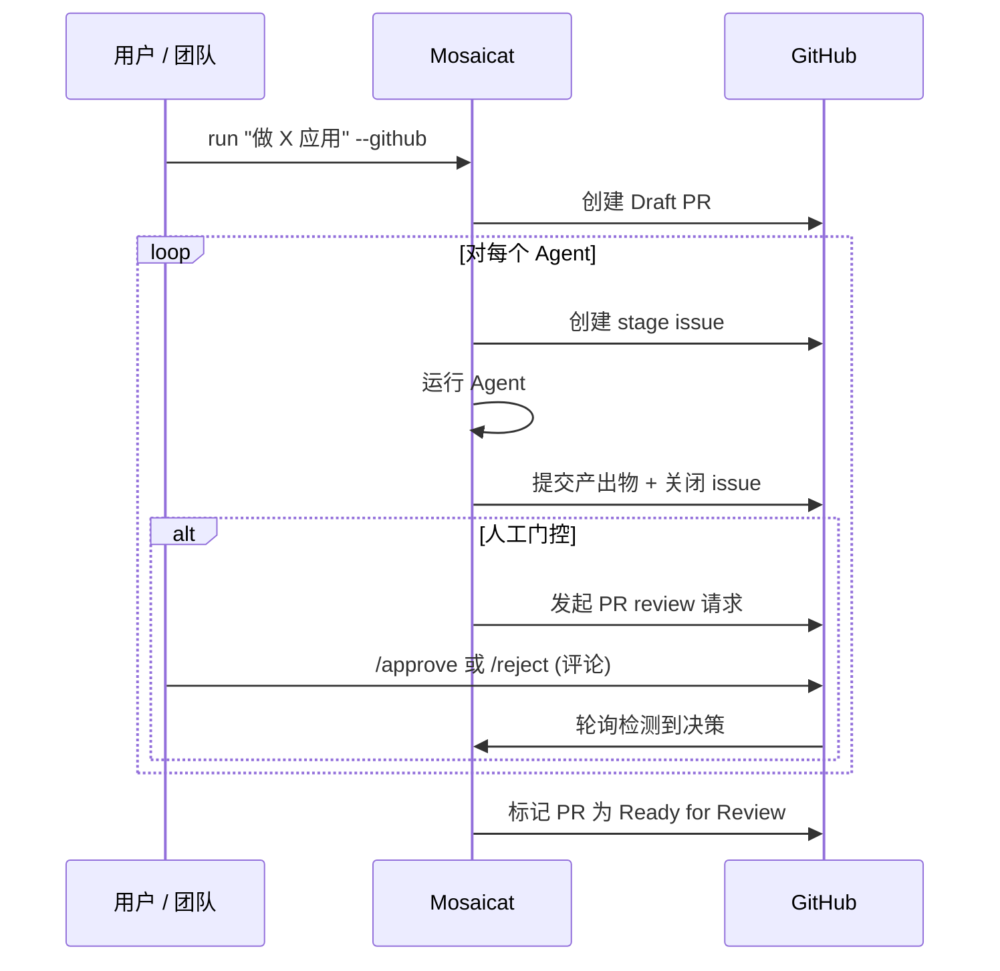
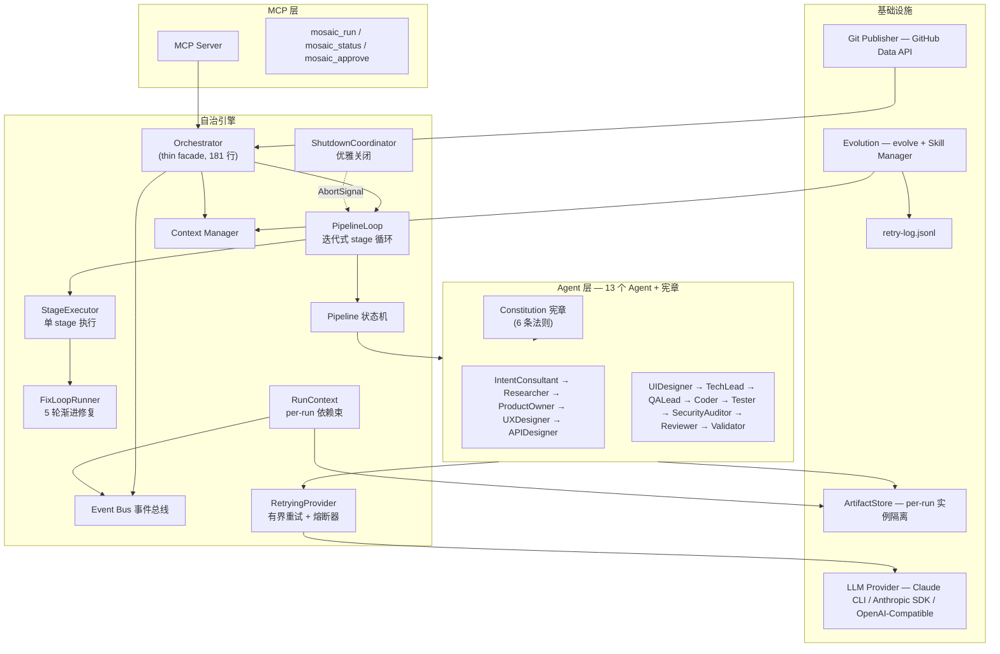

<p align="center">
  
</p>

<p align="center">
  <strong>Spec Coding — 规约驱动的 AI 流水线：一条指令产出<br/>分层规约和经过验收测试验证的代码。</strong>
</p>

<p align="center">
  <a href="README.en.md">English</a> ·
  <a href="#demo">Demo</a> ·
  <a href="#快速开始">快速开始</a> ·
  <a href="#工作原理">工作原理</a> ·
  <a href="#竞品对比">竞品对比</a>
</p>

<p align="center">
  <a href="LICENSE"></a>
  <a href="https://www.typescriptlang.org/"></a>
  <a href="https://nodejs.org/">= 18" /></a>
  <a href="https://modelcontextprotocol.io/"></a>
</p>

---

## Demo

```
$ npx tsx src/index.ts run "做一个个人记账 App"

  Mosaicat v2 — Spec Coding Pipeline

  [1/13] IntentConsultant    ✓  intent-brief.json        12s
  [2/13] Researcher          ✓  research.md              45s
  [3/13] ProductOwner        ⏸  prd.md                   awaiting approval
         → approved
  [3/13] ProductOwner        ✓  prd.md                   38s
  [4/13] UXDesigner          ✓  ux-flows.md              52s
  [5/13] APIDesigner         ✓  api-spec.yaml            31s
  [6/13] UIDesigner          ⏸  components/              awaiting approval
         → approved
  [6/13] UIDesigner          ✓  components/ screenshots/ 4m 18s
  [7/13] TechLead            ⏸  tech-spec.md             awaiting approval
         → approved
  [7/13] TechLead            ✓  tech-spec.md             1m 05s
  [8/13] QALead              ✓  test-plan.md             48s
  [9/13] Coder               ✓  code/                    6m 22s
  [10/13] Tester             ✓  test-report.md           2m 10s
  [11/13] SecurityAuditor    ✓  security-report.md       35s
  [12/13] Reviewer           ⏸  review-report.md         awaiting approval
          → approved
  [12/13] Reviewer           ✓  review-report.md         42s
  [13/13] Validator          ✓  validation-report.md     8s

  ✓ Pipeline complete — 13 stages, 4 approvals, 18m 42s
  → .mosaic/artifacts/run-1774366900/
```

## 为什么选择 Mosaicat？

Mosaicat 实现 **Spec Coding**（规约驱动开发）：用户编写一条指令，13 个 AI Agent 串行处理，逐层生成规约（PRD -> UX 流程 -> API 规范 -> 技术方案），每层规约约束下一个 Agent。代码是最终派生物。验证检查的是跨规约一致性，而非代码质量。

- **人在四个关键环节审批规约**（PRD、设计、架构、代码审查），其余全部自治
- **规约边界隔离误差** — 每个 Agent 只看上游规约，不看其背后的推理过程，误差被隔离在局部
- **验收测试驱动完成** — QALead 先从 PRD Feature 派生测试，Coder 以通过测试为目标，Tester 执行验证
- **6 条不可变宪章** — 所有 Agent 共享同一质量底线，通过 BaseAgent hook 自动注入
- **韧性优先** — LLM 调用有界重试（最多 20 次）+ 熔断器（5 次连续失败后断路，30s 恢复）+ Stage Resume 崩溃恢复

### 核心特性

- **规约驱动流水线** — 意图 -> 分层规约（PRD -> UX -> API -> 技术方案）-> 代码；每层规约是下一个 Agent 的唯一输入契约
- **13 个自治 Agent** — 对应真实产品团队：IntentConsultant、Researcher、ProductOwner、UX/UI Designer、APIDesigner、TechLead、QALead、Coder、Tester、SecurityAuditor、Reviewer、Validator
- **验收 TDD** — QALead 先从 PRD 派生验收测试 -> Coder 以通过测试为目标 -> Tester 执行验证；5 轮渐进式修复循环（rounds 1-2 direct-fix -> round 3 replan-failed-modules -> rounds 4-5 full-history-fix）
- **Agent 宪章** — 6 条不可变质量法则（Verifiability First / Spec Is Authority / No Placeholder / Acceptance-Driven / Traceability / No Ambiguity），BaseAgent hook 自动注入
- **崩溃恢复** — `resume` 从断点续跑；`--from <stage>` 可指定从某个 stage 重跑（自动清理该 stage 及下游的 artifact）
- **LLM 有界重试 + 熔断器** — 指数退避重试瞬时错误（429, 503, 网络），最多 20 次；连续 5 次失败触发熔断器断路（30s HALF_OPEN 恢复）
- **优雅关闭** — SIGINT/SIGTERM 触发 ShutdownCoordinator，完成当前 stage 写入后退出，不留部分 artifact
- **骨架-实现代码生成** — 骨架阶段写所有文件（真实 import/export/路由），实现阶段逐模块替换 stub；每步编译验证
- **集成 QA 流水线** — QALead 生成验收测试，Tester 执行测试，SecurityAuditor 程序化 + LLM 安全审计；测试失败自动触发 Coder 修复
- **构建验证 + 冒烟测试** — 静态分析构建产物（bundle 大小、占位符检测）+ HTTP 冒烟测试
- **交付后修复** — `refine` 诊断并修复生成代码中的问题
- **数据驱动进化** — `evolve` 从 retry-log 真实失败数据分析高频模式，LLM 生成 skill proposal，人工 approve
- **多 LLM 支持** — Claude、OpenAI、Gemini、DeepSeek、通义千问、豆包、Kimi、MiniMax；`setup` 一键切换
- **批量 UI 生成** — 组件按类别分组，LLM 调用减少 80%+；API spec 按 Feature 自动裁剪
- **可配置审批门控** — 全自治、全人工或按阶段任意组合
- **8 项分层验证** — 4 项纯程序化（零 LLM）+ 4 项 manifest 范围 LLM 辅助校验
- **Feature ID 分层追溯** — `F-001` 贯穿 PRD -> UX -> API -> 测试 -> 代码；`T-NNN` 贯穿技术方案 -> 代码
- **可视化设计产出** — React + Tailwind 组件 + Playwright 截图 + HTML 画廊
- **GitHub 原生工作流** — Draft PR、Stage Issue、PR Review 审批 — 融入现有团队流程
- **3 种流水线 Profile** — `design-only` / `full` / `frontend-only`，意图分析自动推荐
- **MCP 兼容** — 作为外部工具服务接入 Claude Code 等 IDE

---

## 竞品对比

| 能力 | Mosaicat | MetaGPT | CrewAI | v0 / bolt.new | Cursor / Windsurf |
|---|:---:|:---:|:---:|:---:|:---:|
| 规约驱动流水线 | ✅ 分层规约 -> 代码 | ❌ | ❌ | ❌ | ❌ |
| 全流程（想法->代码） | ✅ 13 Agent | ✅ | ✅ | ❌ 仅 UI | ❌ 仅代码 |
| 验收 TDD | ✅ QALead -> Coder -> Tester | ❌ | ❌ | ❌ | ❌ |
| 质量宪章 | ✅ 6 条自动注入 | ❌ | ❌ | ❌ | ❌ |
| 崩溃恢复 | ✅ Stage Resume | ❌ | ❌ | ❌ | ❌ |
| 规约一致性验证 | ✅ 8 项检查 | ❌ | ❌ | ❌ | ❌ |
| Feature ID 追溯 | ✅ F-NNN 端到端 | ❌ | ❌ | ❌ | ❌ |
| 可配置审批门控 | ✅ 按阶段配置 | ❌ | ❌ | ❌ | ❌ |
| GitHub 原生工作流 | ✅ PR + Issues | ❌ | ❌ | ❌ | ❌ |
| 可视化设计产出 | ✅ React + Playwright | ❌ | ❌ | ✅ | ❌ |
| 数据驱动进化 | ✅ retry-log -> Skill | ❌ | ❌ | ❌ | ❌ |
| 集成 QA（测试 + 安全） | ✅ 自动测试 + 审计 | ❌ | ❌ | ❌ | ❌ |
| 交付后修复 | ✅ `refine` 命令 | ❌ | ❌ | ❌ | ❌ |
| LLM 有界重试 + 熔断 | ✅ 最多 20 次 + 熔断器 | ❌ | ❌ | N/A | N/A |
| 规约隔离 | ✅ 严格契约 | ❌ 共享内存 | ❌ 共享内存 | N/A | N/A |
| 认证要求 | Claude 订阅 | API Key | API Key | 订阅 | 订阅 |

---

## 快速开始

### 前置要求

| 要求 | 说明 |
|---|---|
| **Node.js** | v18 或更高版本 |
| **LLM 供应商** | 默认：Claude CLI（需要 [Claude 订阅](https://claude.ai/)）。或运行 `npx tsx src/index.ts setup` 配置：Anthropic API、OpenAI、Gemini、DeepSeek、通义千问、豆包、Kimi、MiniMax。 |
| **Playwright**（可选） | 仅 UI 截图生成需要。安装：`npx playwright install chromium`。 |
| **GitHub App**（可选） | 仅 `--github` 模式需要。先将 [Mosaicat GitHub App](https://github.com/apps/mosaicatie) 安装到目标仓库，再通过 `npx tsx src/index.ts login` 完成 OAuth 授权。 |

> **Claude CLI 用户**：Claude Pro / Team / Enterprise 开箱即用，使用 `claude -p` 的 tool use 能力，无需单独的 API Key。使用其他供应商请运行 `npx tsx src/index.ts setup` 输入 API Key。

### 安装与运行

```bash
git clone https://github.com/ZB-ur/mosaicat.git
cd mosaicat
npm install
```

#### 0. 配置 LLM（首次使用）

```bash
npx tsx src/index.ts setup
```

交互式引导：选择供应商 -> 输入 API Key -> 测试连接 -> 完成。随时再次运行可切换供应商。

> 使用 Claude CLI（默认）可跳过此步骤，无需额外配置。

#### 1. 基本运行

```bash
npx tsx src/index.ts run "做一个任务管理应用"
```

IntentConsultant 提出澄清问题，然后流水线运行。人工审批门控在 ProductOwner、UIDesigner、TechLead 和 Reviewer 阶段暂停。

#### 2. 自动审批（CI / 快速原型）

```bash
npx tsx src/index.ts run "做一个任务管理应用" --auto-approve
```

#### 3. 崩溃恢复

```bash
npx tsx src/index.ts resume                    # 恢复最近一次中断的 run
npx tsx src/index.ts resume --run run-17743669  # 恢复指定 run
```

Pipeline 中途崩溃（网络断开、token 超限、Ctrl+C）后，`resume` 从最后完成的 stage 续跑。已完成 stage 的产出不会浪费。

#### 4. GitHub 模式（团队协作）

**第一步 — 安装 GitHub App**

1. 访问 [github.com/apps/mosaicatie](https://github.com/apps/mosaicatie)，点击 **Install**
2. 选择要安装到的账户/组织
3. 推荐选择 **Only select repositories** 并勾选目标仓库，也可选 **All repositories**
4. 点击 **Install** — App 会请求以下权限：
   - **Contents**（读写）— 向仓库提交工件文件
   - **Issues**（读写）— 创建阶段跟踪 Issue
   - **Pull requests**（读写）— 创建 Draft PR 和管理审批门控
   - **Metadata**（只读）— GitHub 基础要求

**第二步 — 登录并运行**

```bash
npx tsx src/index.ts login                                       # 一次性 OAuth 授权（设备流）
npx tsx src/index.ts run "做一个任务管理应用" --github              # 在仓库目录下运行
```

`login` 命令会显示一个一次性验证码 — 在 GitHub 验证页面粘贴即可完成授权。凭证保存在本地 `~/.mosaicat/auth.json`。

创建 Draft PR 和 Stage Issue，团队成员通过 PR 上的 `/approve` 评论审批。如果 App 安装在多个仓库上，会交互式提示选择目标仓库。

#### 5. MCP 模式（IDE 集成）

```bash
npx tsx src/mcp-entry.ts                                      # 启动 MCP server
```

添加到 Claude Code MCP 配置，然后在 IDE 中使用 `mosaic_run` 工具。

#### 6. 修复生成代码

```bash
npx tsx src/index.ts refine "登录按钮点击无反应"
npx tsx src/index.ts refine "首页空白" --run run-1774194269016  # 指定 run
```

`refine` 诊断根因，修复代码，启动 dev server 预览。循环迭代直到满意。

#### 7. 数据驱动进化

```bash
npx tsx src/index.ts evolve
```

分析 retry-log 中的高频失败模式，LLM 生成 skill proposal，交互式 approve/edit/reject。Skill 保存到 `config/skills/builtin/`，后续运行自动加载。

### 使用模式

| | CLI | GitHub | MCP |
|---|---|---|---|
| **界面** | 终端（inquirer） | PR + Issues | Claude Code |
| **审批** | 交互式提示 | PR review 评论 | 工具响应 |
| **产出物** | `.mosaic/artifacts/` | PR commits + 本地 | `.mosaic/artifacts/` |
| **适用场景** | 个人 / 快速原型 | 团队协作 | IDE 集成 |

<details>
<summary><strong>GitHub 模式 — 详细流程</strong></summary>



GitHub 模式融入现有团队工作流 — 设计师在 PR 上审查组件截图，ProductOwner 通过 review 评论审批 PRD，TechLead 签署架构方案。

</details>

---

## 工作原理

```mermaid
graph LR
    IC[Intent<br/>Consultant] --> R[Researcher]
    R --> PO[Product<br/>Owner]
    PO -->|"🔒"| UX[UX<br/>Designer]
    UX --> API[API<br/>Designer]
    API --> UI[UI<br/>Designer]
    UI -->|"🔒"| TL[Tech<br/>Lead]
    TL -->|"🔒"| QA[QA<br/>Lead]
    QA --> C[Coder]
    C --> T[Tester]
    T -->|"fix loop ×5<br/>(direct→replan→full-history)"| C
    T -->|"🔒"| SA[Security<br/>Auditor]
    SA --> RV[Reviewer]
    RV -->|"🔒"| V[Validator]

    style PO fill:#e8b4cb,stroke:#333,color:#000
    style UI fill:#e8b4cb,stroke:#333,color:#000
    style TL fill:#e8b4cb,stroke:#333,color:#000
    style T fill:#e8b4cb,stroke:#333,color:#000
    style RV fill:#e8b4cb,stroke:#333,color:#000
```



> 🔒 = 可配置审批门控（默认人工）。用 `--auto-approve` 跳过，或在 `config/pipeline.yaml` 中按阶段配置。

| # | Agent | 输入 | 输出 | 默认门控 |
|---|---|---|---|---|
| 1 | **IntentConsultant** | 用户指令 | `intent-brief.json` | 自动 |
| 2 | **Researcher** | 意图摘要 | `research.md` + manifest | 自动 |
| 3 | **ProductOwner** | 意图摘要 + 调研 | `prd.md` + manifest | **人工** |
| 4 | **UXDesigner** | PRD | `ux-flows.md` + manifest | 自动 |
| 5 | **APIDesigner** | PRD + UX 流程 | `api-spec.yaml` + manifest | 自动 |
| 6 | **UIDesigner** | PRD + UX + API 规范 | `components/` `screenshots/` `gallery.html` + manifest | **人工** |
| 7 | **TechLead** | PRD + UX + API 规范 | `tech-spec.md` + manifest | **人工** |
| 8 | **QALead** | tech spec + code manifest | `test-plan.md` + 验收测试代码 + manifest | 自动 |
| 9 | **Coder** | tech spec + API spec + 验收测试 | `code/` + manifest（骨架 -> 实现 -> 构建 -> 冒烟测试） | 自动 |
| 10 | **Tester** | 测试计划 + 代码 | `test-report.md` + manifest（失败 -> Coder 修复循环 x5） | **人工** |
| 11 | **SecurityAuditor** | 代码 + code manifest | `security-report.md` + manifest | 自动 |
| 12 | **Reviewer** | tech spec + 代码 | `review-report.md` + manifest | **人工** |
| 13 | **Validator** | 所有 manifest | `validation-report.md`（8 项检查） | 自动 |

### 宪章与验收 TDD

每个 Agent 自动继承 **6 条不可变宪章**（通过 BaseAgent hook 注入），确保统一质量底线。其中最核心的两条：

- **Acceptance-Driven Completion** — 代码完成标准 = 验收测试通过。QALead 从 PRD Feature 派生可执行测试 -> Coder 以通过测试为目标 -> Tester 执行验证。5 轮渐进式修复。
- **No Placeholder Delivery** — 用户可见路径禁止 Placeholder / Coming Soon 等占位内容。

### Manifest 与规约一致性校验

每个 Agent 生成一份 **manifest**（~1-2 KB），声明结构性事实：覆盖了哪些 Feature ID、生成了哪些文件。Validator 执行 **8 项分层检查** — 4 项纯程序化（集合交叉、文件存在性，零 LLM）+ 4 项 LLM 辅助分析（限定在 manifest 范围内）。

---

## 流水线 Profile

| Profile | 阶段 | 使用场景 |
|---|---|---|
| `design-only` | Intent -> Research -> PRD -> UX -> API -> UI -> Validate | 产品规范、设计评审 |
| `full` | 全部 13 个 Agent（含验收 TDD） | 端到端：想法 -> 验收测试验证的代码 |
| `frontend-only` | 跳过 APIDesigner | 前端为主的项目 |

```bash
npx tsx src/index.ts run "做一个博客系统" --profile design-only
```

IntentConsultant 根据指令自动推荐 profile，也可用 `--profile` 覆盖。

---

## 架构



### v2 引擎模块说明

| 模块 | 职责 |
|---|---|
| **Orchestrator** | thin facade（181 行），创建 RunContext 后委托 PipelineLoop 执行 |
| **PipelineLoop** | while 循环迭代 stage，检查 AbortSignal，解释 StageOutcome 决定下一步 |
| **StageExecutor** | 执行单个 stage，返回 StageOutcome 判别联合类型，不递归 |
| **FixLoopRunner** | Tester-Coder 修复循环：rounds 1-2 direct-fix -> round 3 replan-failed-modules -> rounds 4-5 full-history-fix |
| **ShutdownCoordinator** | 处理 SIGINT/SIGTERM，通过 AbortController 通知 PipelineLoop 在当前 stage 完成后优雅退出，双击强制退出 |
| **RunContext** | 不可变依赖束：ArtifactStore / Logger / Provider / EventBus / Config / AbortSignal |
| **ArtifactStore** | per-run 实例，替代旧版全局可变状态，按 run 隔离工件目录 |
| **RetryingProvider** | 装饰所有 LLM Provider，指数退避有界重试（最多 20 次）+ 熔断器（5 次连续失败后断路，30s HALF_OPEN 恢复） |

---

## 设计原则

### Spec Coding：规约即一等公民

> 流水线不是直接生成代码。它生成一条逐层细化的规约链 — PRD -> UX 流程 -> API 规范 -> 技术方案 — 代码是最终派生物。每层规约是下一个 Agent 的唯一输入契约。

当 AI 承担执行时，真正有价值的产出物是规约，而非实现。所有其他设计原则由此推导：

- **规约隔离**存在是因为规约边界必须严格 — 阅读规约的 Agent 不应被其产生过程影响。
- **基于 Manifest 的验证**可行是因为规约具有可程序化校验的结构属性（Feature 覆盖率、端点映射、文件存在性），无需 LLM 判断。
- **审批门控**设置在规约层级之间 — 人类审批一层规约后，下一层才从中派生。

### 宪章：不可变的质量底线

> 13 个 Agent 需要统一的质量标准，但"统一"不等于"写在每个 prompt 里重复 13 次"。

Mosaicat Static Constitution 定义了 6 条不可变法则，通过 BaseAgent hook 自动注入每个 Agent 的 system prompt。违反宪章的产出会被 hook 阻断。

核心法则：验收测试通过才算完成（不只是编译通过）；用户可见路径禁止占位内容；F-NNN 端到端追溯不丢失。

### 验收 TDD：先定义"完成"，再写代码

> 先写代码再测试，发现问题时修复成本高。TDD 让 Coder 有明确的"完成定义"。

QALead 从 PRD Feature 派生可执行验收测试 -> Coder 以通过测试为目标 -> Tester 执行验证。失败触发最多 5 轮渐进修复（rounds 1-2 direct-fix -> round 3 replan-failed-modules -> rounds 4-5 full-history-fix）。每轮累积上下文，策略随轮次递进。

### 契约，而非对话

> 多 Agent 系统的失败很少源于 Agent 不聪明，而是源于共享太多上下文 — 误差关联传播。解法不是更聪明的 Agent，而是更严格的规约边界。

每个 Agent 只看契约内的规约输入，绝不看上游推理过程。UXDesigner 阅读 PRD，但不知道 Researcher 为什么排除了某个竞品。误差被隔离在局部，每个 Agent 带来全新判断。

### 韧性优先：长运行不应脆弱

> 一次完整的 full pipeline 可能运行 30+ 分钟、消耗大量 token。因为一次 429 或网络抖动就全盘作废是不可接受的。

- **RetryingProvider** 装饰所有 LLM Provider，指数退避有界重试（最多 20 次）+ 熔断器保护（5 次连续失败后断路，30s HALF_OPEN 恢复）
- **ShutdownCoordinator** 处理 SIGINT/SIGTERM，通过 AbortSignal 通知 PipelineLoop 在当前 stage 完成后优雅退出
- **Stage Resume** 每个 stage 完成后持久化状态，崩溃后 `resume` 从断点续跑；`--from <stage>` 支持指定 stage 重跑并自动清理下游 artifact
- **retry-log** 持久化所有重试事件，为 `evolve` 提供真实数据

### 数据驱动进化

> stage-level evolution 每个 stage 后一次 LLM 调用，大部分被 cooldown 过滤，成本高于收益。

改为手动 `evolve`：基于 retry-log 真实失败数据（不是 manifest 推测），统计高频模式，LLM 生成 skill proposal，人工逐条 approve。数据驱动 > 猜测驱动。

### 从执行效率到决策效率

传统交付方法论（Scrum、看板）优化人的执行速度。当 AI 承担执行时，瓶颈转移到人的决策速度。Mosaicat 将人的决策放在规约层级之间 — 每个决策点都是对一层规约的审批，之后下一层才从中派生：

- **PRD 审批** — 问题规约正确吗？
- **设计评审** — UX/UI 规约符合意图吗？
- **技术方案签署** — 架构规约合理吗？
- **代码审查** — 实现符合其规约吗？

这些规约审批之间的所有工作自治完成。这本质上就是成熟工程团队的运作方式 — 流水线只是移除了规约签署之间的手动执行。

<details>
<summary>Skill 目录结构</summary>

```
config/skills/builtin/          # 内置 Skill（随代码库版本控制）
├── form-validation-zod/
│   └── SKILL.md
└── vitest-setup/
    └── SKILL.md

.mosaic/evolution/skills/       # 运行时进化产出的 Skill
├── shared/                     # 跨 Agent 共享
│   └── api-naming/
│       └── SKILL.md
└── ux-designer/                # Agent 专属
    └── mobile-first/
        └── SKILL.md
```

Skill 按 trigger 关键词渐进式披露：匹配的全量加载到 prompt，不匹配的只加载摘要。使用统计 + 废弃标记管理生命周期。

</details>

---

## 产出物

每次运行的产出物存储在独立目录中：

```
.mosaic/artifacts/{run-id}/
├── intent-brief.json              # 多轮对话提取的结构化意图
├── research.md                    # 市场调研 + 可行性分析
├── prd.md                         # PRD，含 Feature ID（F-001, F-002...）
├── ux-flows.md                    # 交互流程 + 组件清单
├── api-spec.yaml                  # OpenAPI 3.0 规范
├── components/                    # 25+ React + Tailwind TSX 组件
├── previews/                      # 独立 HTML 预览
├── screenshots/                   # Playwright 渲染的 PNG 截图
├── gallery.html                   # 可视化画廊（内嵌截图）
├── tech-spec.md                   # 技术架构 + 任务分解
├── test-plan.md                   # QALead 验收测试计划
├── tests/acceptance/              # 可执行验收测试（vitest）
├── code/                          # 生成的源代码（骨架 → 实现 → 构建）
├── code-plan.json                 # 模块构建计划（含 smoke test 配置）
├── test-report.md                 # Tester 执行结果
├── security-report.md             # SecurityAuditor 发现（程序化 + LLM）
├── review-report.md               # 代码 vs 规约合规审查
├── validation-report.md           # 8 项交叉验证报告
├── pipeline-state.json            # Pipeline 状态快照（用于 resume）
└── *.manifest.json                # 每个 Agent 的结构声明
```

---

## 路线图

| 里程碑 | 状态 | 亮点 |
|---|---|---|
| **M1** — MVP Pipeline | ✅ 完成 | 6 个 Agent，状态机，CLI Provider |
| **M2** — 可观测性 + 交付 | ✅ 完成 | GitHub 模式，截图，日志系统 |
| **M3** — 想法到代码 | ✅ 完成 | 10 个 Agent，3 个 Profile，Feature ID，自进化 |
| **M6** — 优化 + 质量 + QA | ✅ 完成 | 批量 UI（调用减少 86%），7 家 LLM，骨架-实现 Coder，QA 团队（13 Agent），冒烟测试，`refine` |
| **M7** — 韧性 + 宪章 + 验收 TDD | ✅ 完成 | 6 条宪章，验收 TDD，5 轮渐进修复，Stage Resume，LLM 有界重试 + 熔断器，`evolve` 命令 |
| **v2 核心引擎重写** | ✅ 完成 | Orchestrator thin facade、PipelineLoop、StageExecutor、FixLoopRunner、ShutdownCoordinator、ArtifactStore per-run 实例、RunContext 依赖束 |
| **M8** — 规模 + 企业 | 计划中 | DAG 执行引擎，Per-agent LLM 路由，棕地项目支持 |

---

## 贡献

欢迎贡献。请先开 issue 讨论你想做的改动。

---

## License

[MIT](LICENSE)
