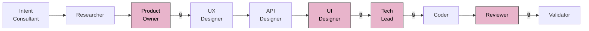
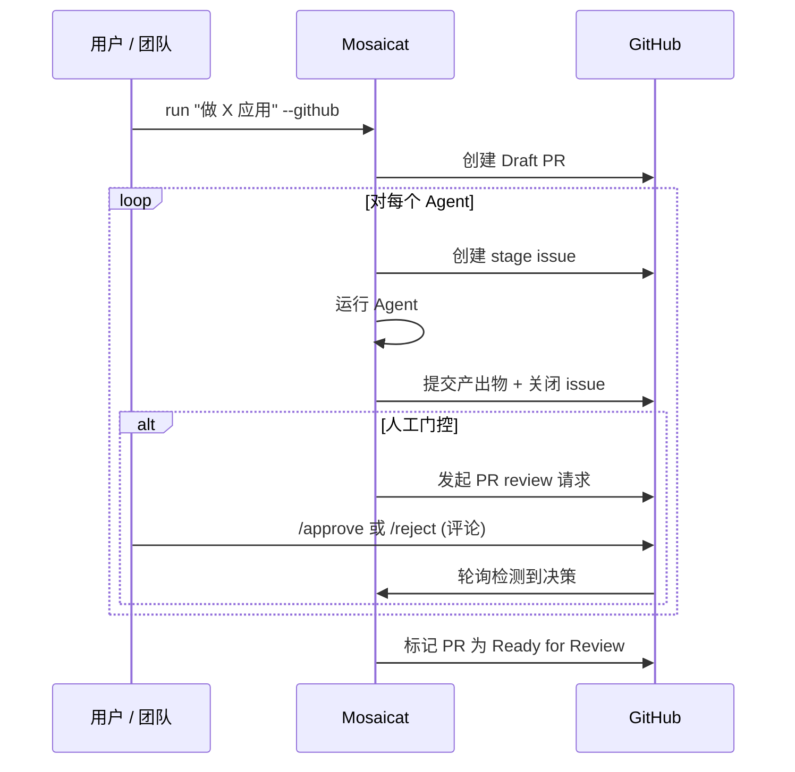
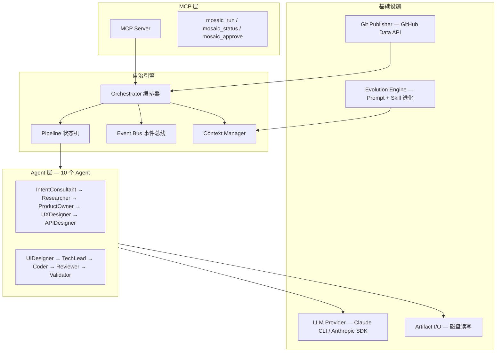

<p align="center">
  <!-- TODO: Replace with custom banner image (1200x400) -->
  
</p>

<p align="center">
  <strong>AI Agent 流水线：一条指令产出完整产品交付物 — <br/>调研、PRD、UX 流程、API 规范、React 组件、代码和代码审查，8 项程序化校验。</strong>
</p>

<p align="center">
  <a href="README.md">English</a> ·
  <a href="#前置要求">前置要求</a> ·
  <a href="#快速开始">快速开始</a> ·
  <a href="#工作原理">工作原理</a> ·
  <a href="#竞品对比">竞品对比</a>
</p>

<p align="center">
  <a href="LICENSE"></a>
  <a href="https://www.typescriptlang.org/"></a>
  <a href="https://nodejs.org/">= 18" /></a>
  <a href="https://modelcontextprotocol.io/"></a>
</p>

---

## 为什么选择 Mosaicat？

传统交付方法论 — Scrum、看板、SAFe — 为优化**人的执行效率**而设计。在 AI 时代，执行从人转移到 Agent，瓶颈随之转移到**人的决策效率**：我们在做正确的事吗？设计合理吗？

Mosaicat 围绕这一洞察重构交付流水线：

- **人仅在四个关键环节决策**（需求审批、设计评审、架构签署、代码审查），其余全部自治
- **Agent 通过契约协调**，而非对话。每个 Agent 只看契约输入，绝不看上游推理过程。误差被隔离，不会关联传播
- **验证分层可控** — 4 项纯程序化检查（零 LLM，完全确定性）+ 4 项 LLM 分析严格限定在结构化 manifest（~1–2 KB）内，取代 50k token 的全量审查
- **知识跨运行积累**。Prompt 进化和 Skill 捕获让每次交付成为组织记忆 — 人类审批是安全门控

```
你:   "做一个个人记账 App，支持收入支出记录和月度报表查看"
       ↓
       10 个 AI Agent 自主运行，人在 4 个关键节点审批
       ↓
产出: 调研 → PRD → UX 流程 → OpenAPI 规范 → 25 个 React 组件 + 截图
      → 技术方案 → 代码 → 代码审查 → 8 项交叉验证报告
```

<!-- TODO: 添加流水线终端输出的 demo GIF 或截图 -->

### 核心特性

- **10 个自治 Agent** — 对应真实产品团队角色：IntentConsultant、Researcher、ProductOwner、UX/UI Designer、APIDesigner、TechLead、Coder、Reviewer、Validator
- **可配置审批门控** — 全自治、全人工或按阶段任意组合
- **8 项分层验证** — 4 项程序化确定性检查（零 LLM）+ 4 项 manifest 范围 LLM 辅助校验，跨工件一致性保障
- **Feature ID 分层追溯** — `F-001` 贯穿 PRD → UX → API → 组件；任务级 `T-NNN` 贯穿技术方案 → 代码
- **可视化设计产出** — React + Tailwind 组件 + Playwright 截图 + HTML 画廊
- **GitHub 原生工作流** — Draft PR、Stage Issue、PR Review 审批 — 无缝融入现有团队流程
- **人类监督下的自进化** — Prompt + Skill 积累，所有提案需人工批准
- **3 种流水线 Profile** — `design-only` / `full` / `frontend-only`，意图分析自动推荐
- **MCP 兼容** — 作为外部工具服务接入 Claude Code 等 IDE

---

## 前置要求

| 要求 | 说明 |
|---|---|
| **Node.js** | v18 或更高版本 |
| **Claude 订阅** | [Claude Pro / Team / Enterprise](https://claude.ai/) — Mosaicat 通过 Claude CLI（`claude -p`）调用 LLM 推理，无需单独的 API Key。 |
| **Claude CLI** | 已安装并完成认证。在终端运行 `claude` 验证。安装指南见 [Claude Code 文档](https://docs.anthropic.com/en/docs/claude-code/overview)。 |
| **Playwright**（可选） | 仅 UI 截图生成需要。安装：`npx playwright install chromium`。 |
| **GitHub App**（可选） | 仅 `--github` 模式需要。先将 [Mosaicat GitHub App](https://github.com/apps/mosaicat) 安装到目标仓库，再通过 `npx tsx src/index.ts login` 完成 OAuth 授权。 |

> **企业 / 团队用户**：Claude Team 和 Enterprise 计划开箱即用。流水线使用 `claude -p` 的 tool use 能力，所有 Claude 订阅方案均包含此功能。无需管理 API Key，无需配置 token 预算。

---

## 快速开始

```bash
git clone https://github.com/ZB-ur/mosaicat.git
cd mosaicat
npm install
```

### 1. 基本运行

```bash
npx tsx src/index.ts run "做一个任务管理应用"
```

IntentConsultant 提出澄清问题，然后流水线运行。人工审批门控在 ProductOwner、UIDesigner、TechLead 和 Reviewer 阶段暂停。

### 2. 自动审批（CI / 快速原型）

```bash
npx tsx src/index.ts run "做一个任务管理应用" --auto-approve
```

### 3. GitHub 模式（团队协作）

```bash
# 1. 安装 Mosaicat GitHub App 到目标仓库：https://github.com/apps/mosaicat
npx tsx src/index.ts login                                    # 2. 一次性 OAuth 授权
npx tsx src/index.ts run "做一个任务管理应用" --github           # 3. 在仓库目录下运行
```

创建 Draft PR 和 Stage Issue，团队成员通过 PR 上的 `/approve` 评论审批。

### 4. MCP 模式（IDE 集成）

```bash
npx tsx src/mcp-entry.ts                                      # 启动 MCP server
```

添加到 Claude Code MCP 配置，然后在 IDE 中使用 `mosaic_run` 工具。

### 5. 开启自进化

```bash
npx tsx src/index.ts run "做一个任务管理应用" --evolve
```

每个阶段完成后，进化引擎分析表现并提出 Prompt 改进或新 Skill。所有提案需人工批准。

---

## 工作原理



> 🔒 = 可配置审批门控（默认人工）。用 `--auto-approve` 跳过，或在 `config/pipeline.yaml` 中按阶段配置。

| # | Agent | 输入 | 输出 | 默认门控 |
|---|---|---|---|---|
| 1 | **IntentConsultant** | 用户指令 | `intent-brief.json` | 自动 |
| 2 | **Researcher** | 意图摘要 | `research.md` + manifest | 自动 |
| 3 | **ProductOwner** | 意图摘要 + 调研 | `prd.md` + manifest | **人工** |
| 4 | **UXDesigner** | PRD | `ux-flows.md` + manifest | 自动 |
| 5 | **APIDesigner** | PRD + UX 流程 | `api-spec.yaml` + manifest | 自动 |
| 6 | **UIDesigner** | PRD + UX + API 规范 | `components/` `screenshots/` `gallery.html` + manifest | **人工** |
| 7 | **TechLead** | PRD + UX + API 规范 | `tech-spec.md` + manifest | **人工** |
| 8 | **Coder** | 技术方案 + API 规范 | `code/` + manifest | 自动 |
| 9 | **Reviewer** | 技术方案 + 代码 | `review-report.md` + manifest | **人工** |
| 10 | **Validator** | 所有 manifest | `validation-report.md`（8 项检查） | 自动 |

### Manifest 与验证

每个 Agent 生成一份 **manifest**（~1–2 KB），声明结构性事实：覆盖了哪些 Feature ID、生成了哪些文件。Validator 执行 **8 项分层检查** — 4 项纯程序化（集合交叉、文件存在性，零 LLM）+ 4 项 LLM 辅助分析（限定在 manifest 范围内）。这是在规模化场景下验证 AI 产出的方式：不依赖另一个 AI 做全量审查。

---

## 流水线 Profile

| Profile | 阶段 | 使用场景 |
|---|---|---|
| `design-only` | Intent → Research → PRD → UX → API → UI → Validate | 产品规范、设计评审 |
| `full` | 全部 10 个 Agent | 端到端：想法 → 验证过的代码 |
| `frontend-only` | 跳过 APIDesigner | 前端为主的项目 |

```bash
npx tsx src/index.ts run "做一个博客系统" --profile design-only
```

IntentConsultant 根据指令自动推荐 profile，也可用 `--profile` 覆盖。

---

## 使用模式

| | CLI | GitHub | MCP |
|---|---|---|---|
| **界面** | 终端（inquirer） | PR + Issues | Claude Code |
| **审批** | 交互式提示 | PR review 评论 | 工具响应 |
| **产出物** | `.mosaic/artifacts/` | PR commits + 本地 | `.mosaic/artifacts/` |
| **适用场景** | 个人 / 快速原型 | 团队协作 | IDE 集成 |

<details>
<summary><strong>GitHub 模式 — 详细流程</strong></summary>



GitHub 模式自然融入现有团队工作流 — 设计师在 PR 上审查组件截图，ProductOwner 通过 review 评论审批 PRD，TechLead 签署架构方案。无需学习新工具。

<!-- TODO: 补充 GitHub PR 工作流真实截图 -->

</details>

---

## 竞品对比

| 能力 | Mosaicat | MetaGPT | CrewAI | v0 / bolt.new | Cursor / Windsurf |
|---|:---:|:---:|:---:|:---:|:---:|
| 全流程（想法→代码） | ✅ 10 个 Agent | ✅ | ✅ | ❌ 仅 UI | ❌ 仅代码 |
| 确定性验证 | ✅ 8 项检查 | ❌ | ❌ | ❌ | ❌ |
| Feature ID 追溯 | ✅ F-NNN 端到端 | ❌ | ❌ | ❌ | ❌ |
| 可配置审批门控 | ✅ 按阶段配置 | ❌ | ❌ | ❌ | ❌ |
| GitHub 原生工作流 | ✅ PR + Issues | ❌ | ❌ | ❌ | ❌ |
| 可视化设计产出 | ✅ React + Playwright | ❌ | ❌ | ✅ | ❌ |
| 自进化 | ✅ 人类审批 | ❌ | ❌ | ❌ | ❌ |
| 工件隔离 | ✅ 严格契约 | ❌ 共享内存 | ❌ 共享内存 | N/A | N/A |
| 认证要求 | Claude 订阅 | API Key | API Key | 订阅 | 订阅 |

---

## 设计原则

### 契约，而非对话

> 多 Agent 系统的失败很少源于 Agent 不聪明，而是源于共享太多上下文 — 误差关联传播。解法不是更聪明的 Agent，而是更严格的边界。

**工件隔离** — 每个 Agent 只看契约输入，绝不看上游推理过程。UXDesigner 阅读 PRD，但不知道 Researcher 为什么排除了某个竞品。这不是限制，这是架构。误差被隔离在局部，每个 Agent 带来全新判断。

**基于 Manifest 的验证** — 全量验证需 50k+ token 且幻觉容易通过。取而代之，每个 Agent 生成 ~1–2 KB 的 manifest 声明结构性事实。Validator 执行 8 项分层检查 — 4 项纯程序化（零 LLM）+ 4 项 LLM 辅助（限定 manifest 范围）。在企业级流水线中，你不能依赖概率性的质量门控。

### 全面开放，必要约束

Agent 在其职责范围内完全自治 — 可以使用工具、派生子 Agent、搜索网络。但自治受可配置约束限定：

| 约束维度 | 配置位置 | 示例 |
|---|---|---|
| **可用工具** | `config/agents.yaml` | Coder: `[Read, Write, Bash, Agent, WebSearch]` |
| **可写路径** | `config/agents.yaml` | Coder: 仅 `.mosaic/artifacts/code/` |
| **最大轮次** | `config/agents.yaml` | Researcher: 3, Coder: 10 |
| **审批门控** | `config/pipeline.yaml` | ProductOwner: 人工, Researcher: 自动 |

全面自治 + 生产级护栏，不是非此即彼的选择。

### 从执行效率到决策效率

传统交付方法论（Scrum、看板）优化人的执行速度。当 AI 承担执行时，瓶颈转移到人的决策速度。Mosaicat 的流水线在恰当的位置要求人类决策：

- **PRD 审批** — 我们在做正确的事吗？
- **设计评审** — UX/UI 符合意图吗？
- **技术方案签署** — 架构合理吗？
- **代码审查** — 实现符合规范吗？

这些检查点之间的所有工作自治完成。这本质上就是成熟工程团队的运作方式 — 流水线只是移除了决策之间的手动执行。

### 自进化：持续增长的组织记忆

每次流水线运行都能改进系统。进化引擎提出：

- **Prompt 进化** — 基于运行结果改进 Agent 系统提示词（版本间 24 小时冷却期）
- **Skill 捕获** — 可复用的领域知识保存为 `SKILL.md` 文件，可跨 Agent 共享或专属于特定 Agent

关键安全约束：
- 所有提案生效前需**人类审批**
- 进化机制本身**不可进化** — 这是刻意的不变量
- Skill 遵循开放的 [Agent Skills 标准](https://github.com/anthropics/agent-skills) 格式

随着时间推移，流水线积累组织知识：命名规范、API 模式、设计偏好、领域特定启发式。这些知识跨团队成员持久化，不随人员流动而丢失 — 它存在于系统中，而非存在于个人脑中。

<details>
<summary>Skill 目录结构</summary>

```
.mosaic/evolution/skills/
├── shared/              # 跨 Agent 共享（如 API 命名规范）
│   └── api-naming/
│       └── SKILL.md
└── ux-designer/         # Agent 专属（如移动优先设计模式）
    └── mobile-first/
        └── SKILL.md
```

</details>

---

## 架构



---

## 产出物

单次 `--profile full` 运行的完整产出：

```
.mosaic/artifacts/
├── intent-brief.json              # 多轮对话提取的结构化意图
├── research.md                    # 市场调研 + 可行性分析
├── prd.md                         # PRD，含 Feature ID（F-001, F-002...）
├── ux-flows.md                    # 交互流程 + 组件清单
├── api-spec.yaml                  # OpenAPI 3.0 规范
├── components/                    # 25+ React + Tailwind TSX 组件
├── previews/                      # 独立 HTML 预览
├── screenshots/                   # Playwright 渲染的 PNG 截图
├── gallery.html                   # 可视化画廊（内嵌截图）
├── tech-spec.md                   # 技术架构 + 任务分解
├── code/                          # 生成的源代码
├── review-report.md               # 代码 vs 规范合规审查
├── validation-report.md           # 8 项交叉验证报告
└── *.manifest.json                # 每个 Agent 的结构声明
```

<!-- TODO: 补充真实流水线运行的截图 -->

---

## 路线图

| 里程碑 | 状态 | 亮点 |
|---|---|---|
| **M1** — MVP Pipeline | ✅ 完成 | 6 个 Agent，状态机，CLI Provider |
| **M2** — 可观测性 + 交付 | ✅ 完成 | GitHub 模式，截图，日志系统 |
| **M3** — 想法到代码 | ✅ 完成 | 10 个 Agent，3 个 Profile，Feature ID，自进化 |
| **M4** — 质量 + 规模 | 计划中 | QA 团队 Agent，DAG 引擎，棕地项目支持 |

---

## 贡献

欢迎贡献。请先开 issue 讨论你想做的改动。

<!-- TODO: 项目公开后添加 contrib.rocks 贡献者墙 -->

---

## License

[MIT](LICENSE)

<!--
## Star History

TODO: 项目获得关注后添加 star history 图表
[](https://star-history.com/#ZB-ur/mosaicat&Date)
-->
