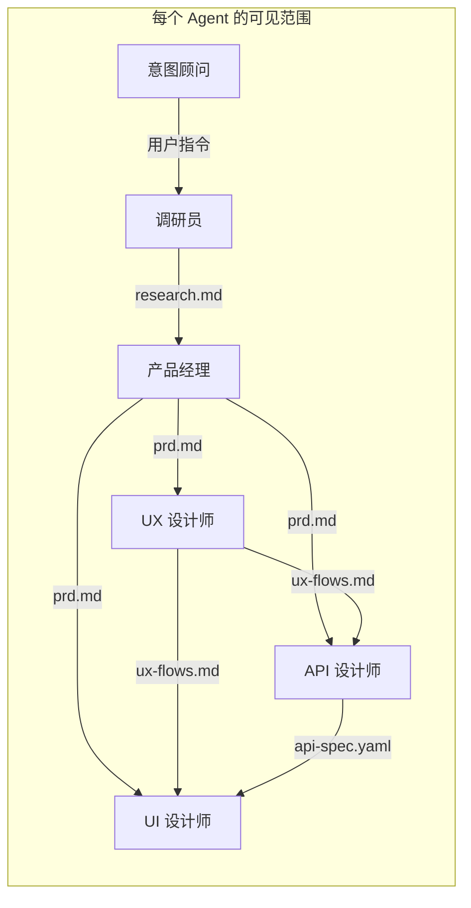
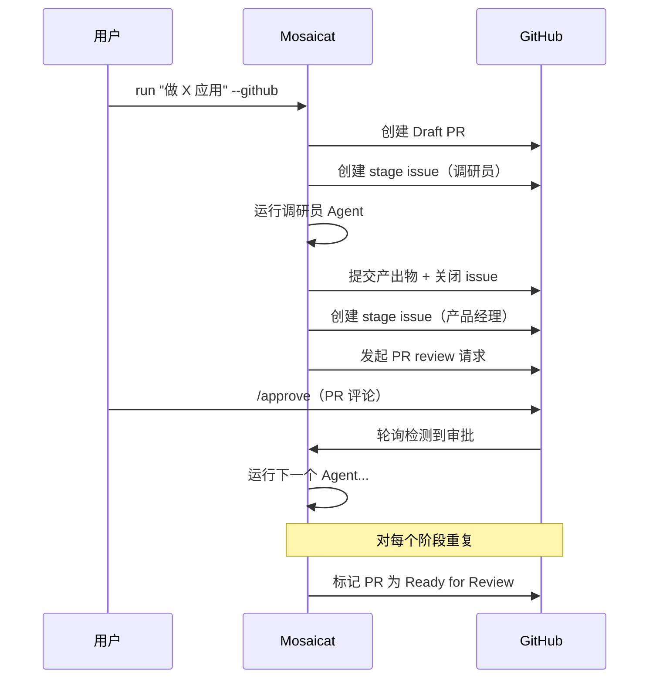
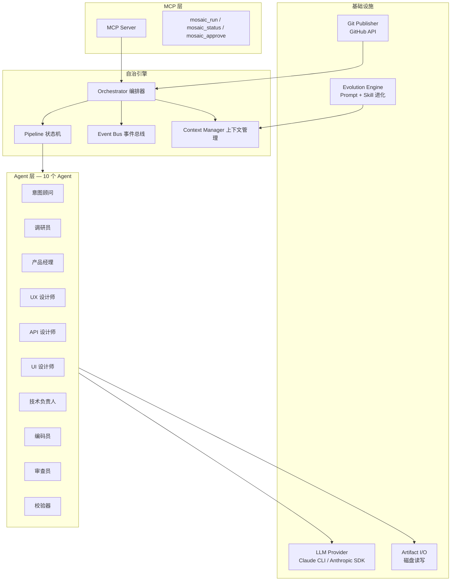

# Mosaicat

**一条指令，十个 AI Agent 协作，完整产品交付物 — 程序化验证。**

[English](README.md)

<!-- [](LICENSE) -->
[](https://www.typescriptlang.org/)
[](https://nodejs.org/)
[](https://modelcontextprotocol.io/)

---

## 10 秒介绍

一条指令，10 个 AI Agent 协作产出完整产品交付物：调研报告、PRD、UX 流程、OpenAPI 规范、React 组件截图、技术方案、代码和代码审查 — 8 项程序化校验确保一致性。

无需 API Key，无需配置，只需 Claude 订阅和一条命令。

---

## 设计哲学：契约层

**为什么更笨的接口能构建更聪明的系统**

多 Agent 系统失败的原因不是 Agent 不够聪明，而是它们共享了太多上下文。当 Agent B 看到 Agent A 的推理过程，误差会关联传播。解决方案不是更聪明的 Agent，而是更严格的边界。

### 工件隔离 = 信息卫生

每个 Agent 只看到其契约输入，绝不看上游的推理过程。UX 设计师阅读 PRD，但不知道调研员为什么排除了某个竞品。这不是限制 — 这是架构。误差被隔离在局部。每个 Agent 对其契约输入带来全新的判断。

### Manifest = 不靠 AI 验证 AI

全量工件验证需要 50k+ token，且幻觉容易通过检查。取而代之，每个 Agent 生成一份 manifest（~500 字节），声明结构性事实："我覆盖了 F-001、F-002 功能点。" Validator 执行 8 项确定性检查 — 集合交叉、文件存在性、schema 一致性 — 无需 LLM 参与。

### 从执行效率到决策效率

传统方法论优化人的执行速度。AI 时代，执行近乎免费，瓶颈转移到人的决策速度。Mosaicat 的流水线在恰好两个关键点需要人类决策：PRD 对不对？设计稿好不好？其余全部自主完成。

### 进化 = 组织记忆

Prompt 进化 + Skill 积累 = 超越单次运行的组织知识沉淀。但所有进化需人类批准，且进化机制本身不可进化 — 这是对失控自我修改的刻意约束。

> Mosaicat 不是使用 AI Agent 的更好方式，而是关于 AI Agent 应如何协调的不同理论：通过契约，而非对话。

---

## 工作原理

```mermaid
graph LR
    IC[意图顾问] --> R[调研员]
    R --> PO[产品经理]
    PO -->|🔒 人工审批| UX[UX 设计师]
    UX --> API[API 设计师]
    API --> UI[UI 设计师]
    UI -->|🔒 人工审批| TL[技术负责人]
    TL -->|🔒 人工审批| C[编码员]
    C --> RV[审查员]
    RV -->|🔒 人工审批| V[校验器]

    style PO fill:#f9f,stroke:#333
    style UI fill:#f9f,stroke:#333
    style TL fill:#f9f,stroke:#333
    style RV fill:#f9f,stroke:#333
```



<sub>粉色节点 = 人工审批门控。其余为自动流转。</sub>

| Agent | 输入 | 输出 | 门控 |
|---|---|---|---|
| **意图顾问** | 用户指令 | `intent-brief.json` | 自动 |
| **调研员** | `intent-brief.json` | `research.md` + manifest | 自动 |
| **产品经理** | `intent-brief.json` + `research.md` | `prd.md` + manifest | **人工** |
| **UX 设计师** | `prd.md` | `ux-flows.md` + manifest | 自动 |
| **API 设计师** | `prd.md` + `ux-flows.md` | `api-spec.yaml` + manifest | 自动 |
| **UI 设计师** | `prd.md` + `ux-flows.md` + `api-spec.yaml` | `components/` + `screenshots/` + `gallery.html` + manifest | **人工** |
| **技术负责人** | `prd.md` + `ux-flows.md` + `api-spec.yaml` | `tech-spec.md` + manifest | **人工** |
| **编码员** | `tech-spec.md` + `api-spec.yaml` | `code/` + manifest | 自动 |
| **审查员** | `tech-spec.md` + `code/` + `code.manifest.json` | `review-report.md` + manifest | **人工** |
| **校验器** | 所有 `*.manifest.json` | `validation-report.md` | 自动 |

每个 manifest 是一份 ~500 字节的结构声明（覆盖的 Feature ID、生成的文件）。Validator 通过 8 项程序化检查交叉验证 — 无 LLM 参与。

### 工件隔离边界



Agent 之间仅通过磁盘文件通信。无共享内存，无流水线历史。每个 Agent 恰好看到其契约输入 — 不多不少。

---

## 竞品对比

| 能力 | Mosaicat | MetaGPT | CrewAI | v0 / bolt.new | Cursor / Windsurf |
|---|:---:|:---:|:---:|:---:|:---:|
| 全流程（想法→代码） | ✅ 10 个 Agent | ✅ | ✅ | ❌ 仅 UI | ❌ 仅代码 |
| 结构化验证（8 项检查） | ✅ 确定性 | ❌ | ❌ | ❌ | ❌ |
| Feature ID 追溯（F-NNN） | ✅ 端到端 | ❌ | ❌ | ❌ | ❌ |
| GitHub 原生工作流（PR + Review） | ✅ Draft PR + Issues | ❌ | ❌ | ❌ | ❌ |
| 可视化设计产出 | ✅ React + Playwright | ❌ | ❌ | ✅ | ❌ |
| 自进化 | ✅ Prompt + Skill | ❌ | ❌ | ❌ | ❌ |
| 认证要求 | 仅 Claude 订阅 | API Key | API Key | 订阅 | 订阅 |
| 工件隔离 | ✅ 严格契约 | ❌ 共享内存 | ❌ 共享内存 | N/A | N/A |

---

## 快速开始

```bash
git clone https://github.com/anthropics/mosaicat.git
cd mosaicat
npm install
```

### CLI — 交互模式

```bash
npx tsx src/index.ts run "做一个任务管理应用"
```

意图顾问会提出澄清问题，然后流水线运行，在产品经理、UI 设计师、技术负责人和审查员阶段设有人工审批门控。

### CLI — 自动审批

```bash
npx tsx src/index.ts run "做一个任务管理应用" --auto-approve
```

跳过所有人工门控。适合快速迭代或 CI 场景。

### GitHub 模式

```bash
npx tsx src/index.ts login          # 一次性 OAuth 设备授权
npx tsx src/index.ts run "做一个任务管理应用" --github
```

创建 Draft PR，为每个 Agent 开 stage issue，通过 PR review 评论进行审批。

### MCP 模式

添加到 Claude Code MCP 配置，然后在 Claude Code 中使用 `mosaic_run` 工具。

```bash
npx tsx src/mcp-entry.ts
```

---

## 使用模式

| | CLI 模式 | GitHub 模式 | MCP 模式 |
|---|---|---|---|
| **界面** | 终端（inquirer） | GitHub PR + Issues | Claude Code |
| **审批** | 交互式提示 | PR review 评论 | 工具响应 |
| **产出物** | `.mosaic/artifacts/` | PR commits + 本地 | `.mosaic/artifacts/` |
| **适用场景** | 快速迭代 | 团队协作 | IDE 集成 |

### GitHub 模式流程



<!-- TODO: 补充 GitHub PR 工作流真实截图 -->

---

## 流水线 Profile

选择流水线的执行范围：

| Profile | 阶段 | 使用场景 |
|---|---|---|
| **design-only** | 意图顾问 → 调研员 → 产品经理 → UX 设计师 → API 设计师 → UI 设计师 → 校验器 | 产品规范 + 视觉设计 |
| **full** | 全部 10 个 Agent | 端到端：想法 → 代码 + 审查 |
| **frontend-only** | 跳过 API 设计师 | 前端为主的项目 |

```bash
# 显式指定 profile
npx tsx src/index.ts run "做一个博客系统" --profile design-only

# 意图顾问根据你的指令推荐 profile
npx tsx src/index.ts run "做一个博客系统"
```

---

## 架构



---

## 自进化系统

每个流水线阶段完成后，进化引擎分析表现并可能提出：

- **Prompt 进化**：改进 Agent 的系统提示词（版本间 24 小时冷却期）
- **Skill 创建**：将可复用的领域知识捕获为 `SKILL.md` 文件（无冷却期）

所有提案需**人类批准**。进化机制本身不可进化 — 这是刻意的安全约束。

Skill 遵循 [Agent Skills 开放标准](https://github.com/anthropics/agent-skills) 格式：
```
.mosaic/evolution/skills/
├── shared/           # 跨 Agent 共享 Skill
│   └── api-naming/
│       └── SKILL.md
└── ux-designer/      # Agent 专属 Skill
    └── mobile-first/
        └── SKILL.md
```

---

## 产出物一览

单次流水线运行的完整产出：

```
.mosaic/artifacts/
├── intent-brief.json          # 从用户对话中提取的结构化意图
├── research.md                # 市场调研 + 可行性分析
├── research.manifest.json
├── prd.md                     # 产品需求文档
├── prd.manifest.json          # Feature ID: F-001, F-002, ...
├── ux-flows.md                # 交互流程 + 组件清单
├── ux-flows.manifest.json
├── api-spec.yaml              # OpenAPI 3.0 规范
├── api-spec.manifest.json
├── components/                # React + Tailwind TSX 组件
│   ├── Toast.tsx
│   ├── RecordList.tsx
│   └── ...
├── previews/                  # 独立 HTML 预览
├── screenshots/               # Playwright 渲染的 PNG 截图
├── gallery.html               # 可视化画廊（base64 内嵌图片）
├── components.manifest.json
├── tech-spec.md               # 技术架构 + 实施计划
├── tech-spec.manifest.json
├── code/                      # 生成的源代码
├── code.manifest.json
├── review-report.md           # 代码 vs 规范审查报告
├── review.manifest.json
└── validation-report.md       # 8 项交叉验证报告
```

<!-- TODO: 补充 gallery.html 示例截图 -->

---

## 路线图

**M3（当前）** — 已完成。10 个 Agent，3 个 Profile，完整的从想法到代码审查的全流程。

**M4（下一步）**：
- QA 团队 Agent（QALead、Tester、SecurityAuditor）
- DAG 执行引擎，支持并行阶段组
- 棕地项目初始化器（Project Initializer）
- 棕地知识层 MCP（codebase-memory、Repomix、ast-grep）

---

## License

[MIT](LICENSE)
