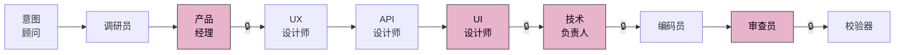
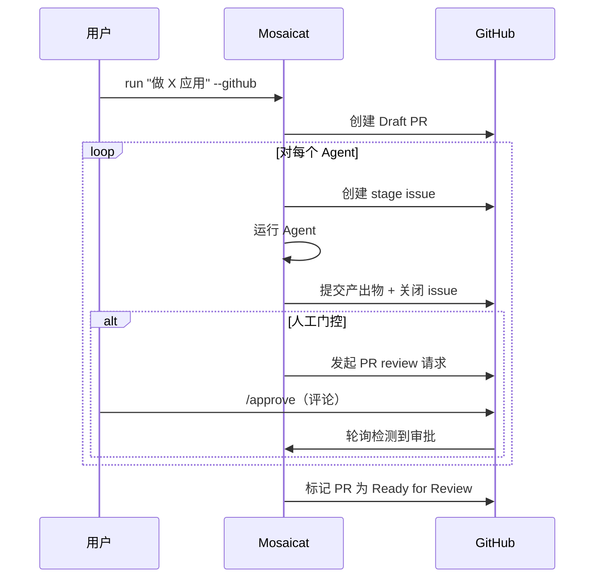
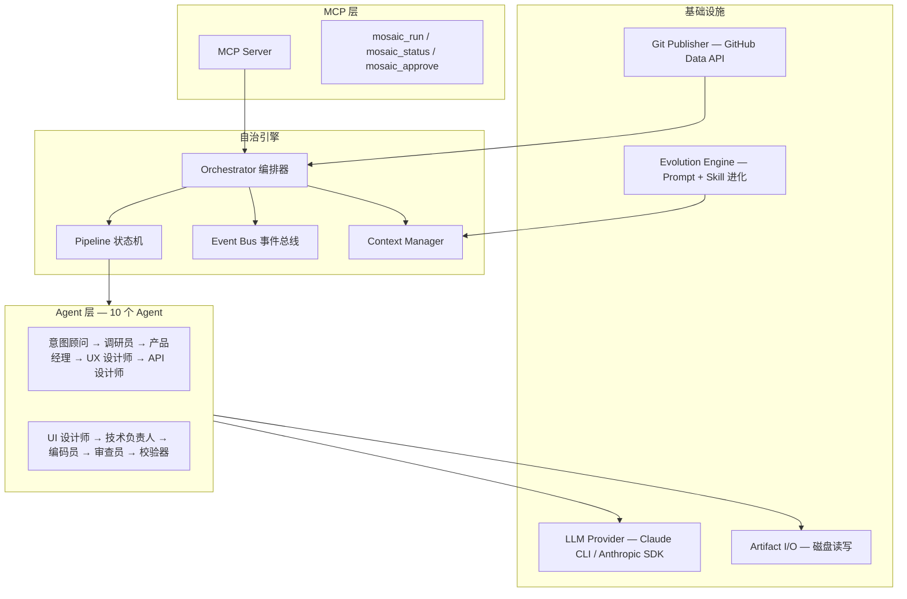

<p align="center">
  <!-- TODO: Replace with custom banner image (1200x400) -->
  
</p>

<p align="center">
  <strong>一条指令，十个 AI Agent 协作产出完整产品交付物 — 8 项程序化校验确保一致性。</strong>
</p>

<p align="center">
  <a href="README.md">English</a> ·
  <a href="#快速开始">快速开始</a> ·
  <a href="#工作原理">工作原理</a> ·
  <a href="#竞品对比">竞品对比</a>
</p>

<p align="center">
  <a href="LICENSE"></a>
  <a href="https://www.typescriptlang.org/"></a>
  <a href="https://nodejs.org/">= 18" /></a>
  <a href="https://modelcontextprotocol.io/"></a>
</p>

---

## Mosaicat 是什么？

```
你:   "做一个个人记账 App，支持收入支出记录和月度报表查看"
       ↓
       10 个 AI Agent 自主运行
       ↓
产出: 调研 → PRD → UX 流程 → OpenAPI 规范 → 25 个 React 组件 + 截图
      → 技术方案 → 代码 → 代码审查 → 8 项交叉验证报告
```

无需 API Key，无需配置，只需 Claude 订阅和一条命令。

<!-- TODO: 添加流水线终端输出的 demo GIF 或截图 -->

### 核心特性

- **10 个自治 Agent** — 从意图澄清到代码审查，每个 Agent 有明确的输入/输出契约
- **8 项程序化验证** — 确定性交叉验证，无 LLM 参与
- **Feature ID 端到端追溯** — `F-001` → `F-002` 贯穿 PRD → UX → API → 代码
- **可视化设计产出** — React + Tailwind 组件 + Playwright 截图 + 画廊
- **3 种流水线 Profile** — `design-only` / `full` / `frontend-only`，意图自动推荐
- **GitHub 原生工作流** — Draft PR + Stage Issue + PR Review 审批
- **自进化系统** — Prompt + Skill 积累，人类审批后生效
- **MCP 兼容** — 可作为 Claude Code 内置工具使用

---

## 工作原理



> 🔒 = 人工审批门控。人在 PRD 和设计稿处决策，其余全部自治。

| # | Agent | 输入 | 输出 | 门控 |
|---|---|---|---|---|
| 1 | **意图顾问** | 用户指令 | `intent-brief.json` | 自动 |
| 2 | **调研员** | 意图摘要 | `research.md` + manifest | 自动 |
| 3 | **产品经理** | 意图摘要 + 调研 | `prd.md` + manifest | **人工** |
| 4 | **UX 设计师** | PRD | `ux-flows.md` + manifest | 自动 |
| 5 | **API 设计师** | PRD + UX 流程 | `api-spec.yaml` + manifest | 自动 |
| 6 | **UI 设计师** | PRD + UX + API 规范 | `components/` `screenshots/` `gallery.html` + manifest | **人工** |
| 7 | **技术负责人** | PRD + UX + API 规范 | `tech-spec.md` + manifest | **人工** |
| 8 | **编码员** | 技术方案 + API 规范 | `code/` + manifest | 自动 |
| 9 | **审查员** | 技术方案 + 代码 | `review-report.md` + manifest | **人工** |
| 10 | **校验器** | 所有 manifest | `validation-report.md`（8 项检查） | 自动 |

每个 Agent 生成一份 **manifest**（~500 字节）— 声明覆盖了哪些功能点（`F-001`、`F-002`...）。校验器对所有 manifest 执行 8 项确定性检查，验证过程无 LLM 参与。

---

## 快速开始

```bash
git clone https://github.com/anthropics/mosaicat.git
cd mosaicat && npm install
```

**交互模式** — 意图顾问提问，人工门控暂停等待审批：

```bash
npx tsx src/index.ts run "做一个任务管理应用"
```

**自动审批** — 跳过所有门控，全速运行：

```bash
npx tsx src/index.ts run "做一个任务管理应用" --auto-approve
```

**GitHub 模式** — Draft PR + Stage Issue + PR Review 审批：

```bash
npx tsx src/index.ts login                                    # 一次性 OAuth 授权
npx tsx src/index.ts run "做一个任务管理应用" --github
```

**MCP 模式** — 在 Claude Code 中使用：

```bash
npx tsx src/mcp-entry.ts                                      # 启动 MCP server
```

---

## 流水线 Profile

| Profile | Agent 范围 | 使用场景 |
|---|---|---|
| `design-only` | 意图 → 调研 → PRD → UX → API → UI → 校验 | 产品规范 + 视觉设计 |
| `full` | 全部 10 个 Agent | 想法 → 代码 + 审查 |
| `frontend-only` | 跳过 API 设计师 | 前端为主的项目 |

```bash
npx tsx src/index.ts run "做一个博客系统" --profile design-only
```

意图顾问根据你的指令自动推荐 profile，也可用 `--profile` 覆盖。

---

## 使用模式

| | CLI | GitHub | MCP |
|---|---|---|---|
| **界面** | 终端（inquirer） | PR + Issues | Claude Code |
| **审批** | 交互式提示 | PR review 评论 | 工具响应 |
| **产出物** | `.mosaic/artifacts/` | PR commits + 本地 | `.mosaic/artifacts/` |
| **适用场景** | 快速迭代 | 团队协作 | IDE 集成 |

<details>
<summary><strong>GitHub 模式 — 详细流程</strong></summary>



<!-- TODO: 补充 GitHub PR 工作流真实截图 -->

</details>

---

## 竞品对比

| 能力 | Mosaicat | MetaGPT | CrewAI | v0 / bolt.new | Cursor / Windsurf |
|---|:---:|:---:|:---:|:---:|:---:|
| 全流程（想法→代码） | ✅ 10 个 Agent | ✅ | ✅ | ❌ 仅 UI | ❌ 仅代码 |
| 结构化验证 | ✅ 8 项确定性检查 | ❌ | ❌ | ❌ | ❌ |
| Feature ID 追溯 | ✅ F-NNN 端到端 | ❌ | ❌ | ❌ | ❌ |
| GitHub 原生工作流 | ✅ PR + Issues | ❌ | ❌ | ❌ | ❌ |
| 可视化设计产出 | ✅ React + Playwright | ❌ | ❌ | ✅ | ❌ |
| 自进化 | ✅ Prompt + Skill | ❌ | ❌ | ❌ | ❌ |
| 认证要求 | 仅 Claude 订阅 | API Key | API Key | 订阅 | 订阅 |
| 工件隔离 | ✅ 严格契约 | ❌ 共享内存 | ❌ 共享内存 | N/A | N/A |

---

## 契约层 — 为什么更笨的接口能构建更聪明的系统

> 多 Agent 系统的核心失败模式不是 Agent 不聪明，而是共享太多上下文导致误差关联传播。解决方案不是更聪明的 Agent，而是更严格的边界。

**工件隔离** — 每个 Agent 只看契约输入，绝不看上游推理过程。UX 设计师阅读 PRD，但不知道调研员为什么排除了某个竞品。误差被隔离在局部。

**Manifest 验证** — 全量验证需 50k+ token 且幻觉容易通过。取而代之，每个 Agent 生成 ~500 字节的 manifest 声明结构性事实。校验器执行 8 项确定性检查 — 集合交叉、文件存在性、schema 一致性 — 零 LLM。

**决策效率** — 传统方法论优化执行速度。AI 时代执行近乎免费，瓶颈是决策速度。流水线只在两个关键点需要人类决策：PRD 对不对？设计稿好不好？其余全自治。

**进化即记忆** — Prompt 进化 + Skill 积累 = 组织知识沉淀。但所有进化需人类批准，进化机制本身不可进化 — 刻意约束。

> Mosaicat 不是使用 AI Agent 的更好方式，而是关于 AI Agent 应如何协调的不同理论：通过契约，而非对话。

---

## 架构



---

## 产出物一览

单次 `--profile full` 运行的完整产出：

```
.mosaic/artifacts/
├── intent-brief.json              # 多轮对话提取的结构化意图
├── research.md                    # 市场调研 + 可行性分析
├── prd.md                         # PRD，含 Feature ID（F-001, F-002...）
├── ux-flows.md                    # 交互流程 + 组件清单
├── api-spec.yaml                  # OpenAPI 3.0 规范
├── components/                    # 25+ React + Tailwind TSX 组件
├── previews/                      # 独立 HTML 预览
├── screenshots/                   # Playwright 渲染的 PNG 截图
├── gallery.html                   # 可视化画廊（内嵌截图）
├── tech-spec.md                   # 技术架构 + 任务分解
├── code/                          # 生成的源代码
├── review-report.md               # 代码 vs 规范合规审查
├── validation-report.md           # 8 项交叉验证报告
└── *.manifest.json                # 每个 Agent 的结构声明
```

<!-- TODO: 补充真实流水线运行的截图 -->

---

## 自进化系统

每个阶段完成后，进化引擎可能提出：

- **Prompt 进化** — 改进 Agent 系统提示词（24 小时冷却期）
- **Skill 创建** — 可复用领域知识，`SKILL.md` 格式（无冷却期）

所有提案需**人类批准**。进化机制本身不可进化。

<details>
<summary>Skill 目录结构</summary>

```
.mosaic/evolution/skills/
├── shared/              # 跨 Agent 共享
│   └── api-naming/
│       └── SKILL.md
└── ux-designer/         # Agent 专属
    └── mobile-first/
        └── SKILL.md
```

</details>

---

## 路线图

| 里程碑 | 状态 | 亮点 |
|---|---|---|
| **M1** — MVP Pipeline | ✅ 完成 | 6 个 Agent，状态机，CLI Provider |
| **M2** — 可观测性 + 交付 | ✅ 完成 | GitHub 模式，截图，日志系统 |
| **M3** — 想法到代码 | ✅ 完成 | 10 个 Agent，3 个 Profile，Feature ID，进化系统 |
| **M4** — 质量 + 规模 | 计划中 | QA 团队，DAG 引擎，棕地项目 |

---

## 贡献

欢迎贡献！请先开 issue 讨论你想做的改动。

<!-- TODO: 项目公开后添加 contrib.rocks 贡献者墙 -->

---

## License

[MIT](LICENSE)

<!--
## Star History

TODO: 项目获得关注后添加 star history 图表
[](https://star-history.com/#ZB-ur/mosaicat&Date)
-->
